# 실무자를 위한 Git 관련 정리 

## 헷갈리기 쉬운 Git 주요 명령어 및 간단 설명 

- git reset
    - git reset [file] : file unstage (git add 한 것을 반대 개념)
    - git reset [commit] : 파일 내용은 바꾸지 않지만, 지정한 commit 이후에 있던 commit을 다 삭제한다. 
    - git reset --hard [commit] : 지정한 commit 상태로 모든 것을 되돌린다 (작성한 파일도 삭제 되니까 매우 조심)
- git revert [commit] : 새로운 commit을 생성해서 add하는 adds a new commit history to the project
    - 5개의 commit을 생성해도 순서와 상관없이 지정한 commit만 revert (commit 전 상태) 가 된다
- git stash (push): commit하지 않은 내용을 현 branch에 저장한다. (그리고 파일은 변경사항 이전으로 되돌아 간다)
    - 사용처: 급하게 작업하기 전 코드에서 디버깅을 해야하는데 현재 작업하던 변경내용을 유지하고 싶을 때 (일시적인 작업 저장 공간)
    - git stash list : stash에 저장되어있는 commit의 목록을 보여준다
    - git stash pop : pop이기에 가장 최근에 stash에 push 한 것을 적용시키면서 stash list에서 삭제된다. (commit이 아니라 파일만 변경된것이다)
    - git stash apply (stash@{1}) : stash list 0번 혹은 지정한 stash를 apply 한다. 단, 목록에서 사라지지는 않는다.
    - git stash drop (stash@{1}) : stash list 0번 혹은 지정한 stash 삭제

- git revert 와 reset 차이 : reset 같은 경우 commit **기록이 남지 않는다** (깔끔하다). 반대로 revert 같은 경우 작성한 코드의 **반대만큼의 commit을 자동으로 생성**하기에 기록이 남는다.
- git rebase : 작업한 내용을 다른 branch (develop 혹은 master)에 merge 하고 싶을 때 사용한다. ([sourcetree에서 rebase(재배치) 방법](https://wckhg89.github.io/archivers/rebase))
    - 사용처 : 작업하고 있는데 누군가가 develop을 업데이트 했을 시에 필요.
        - 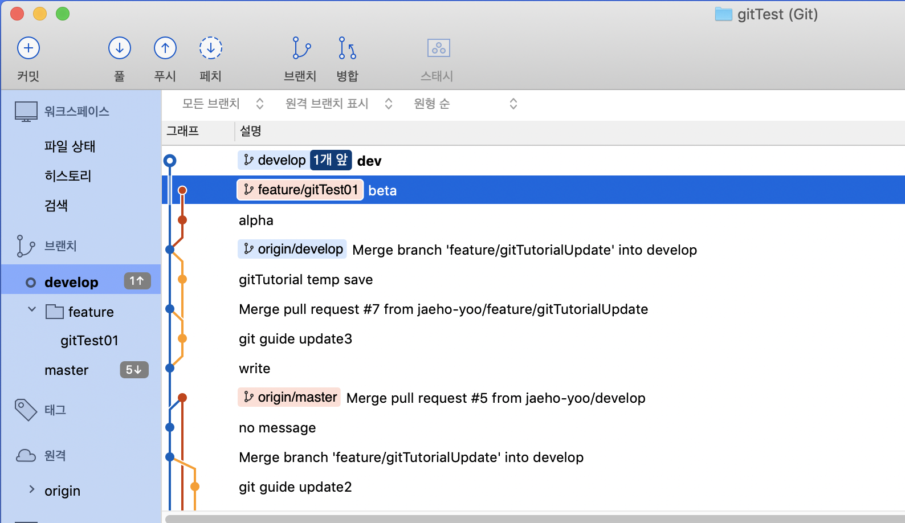
        - 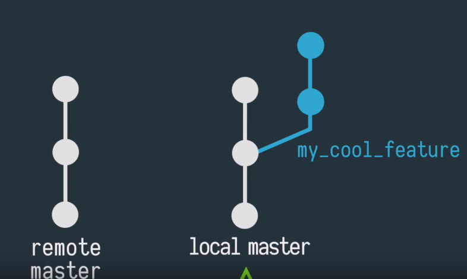
    
        - git checkout feature_branch -> git rebase develop(혹은 master) (master branch 앞으로 작업한 feature branch들을 이동시킨다. 이때 conflict나면 알려준다)
            - 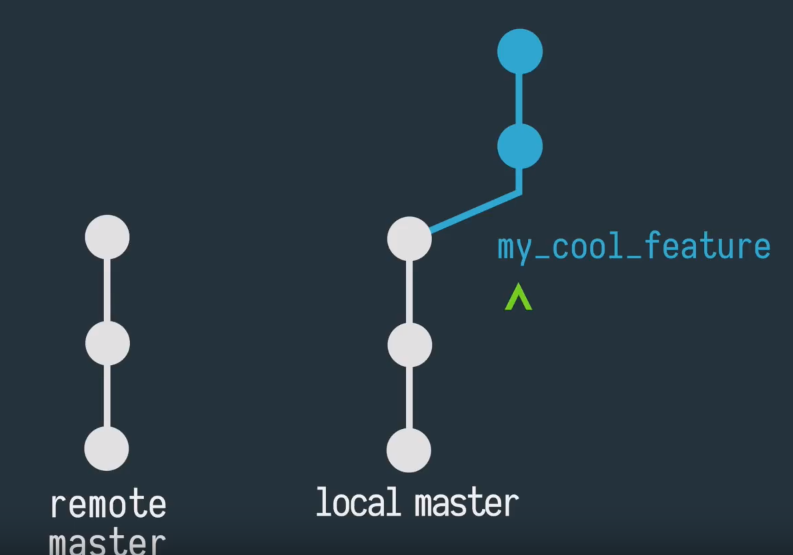
        - git checkout master -> git rebase feature_branch (이제 local master branch가 깔끔해졌다)
        - git push
            - 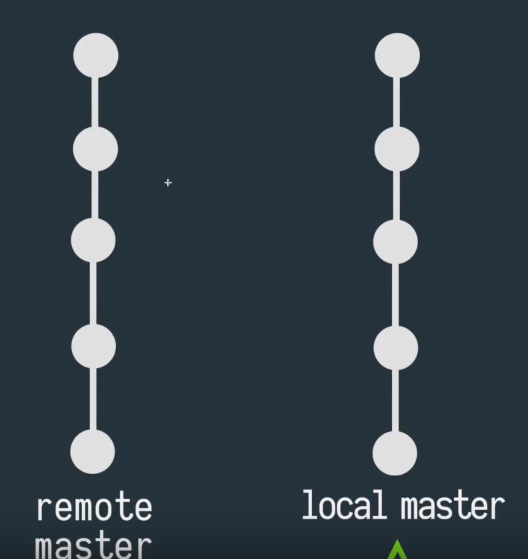

    - squash
        - ```git rebase -i HEAD~3``` (최신 3개의 commit을 이용할 것이다)
            - 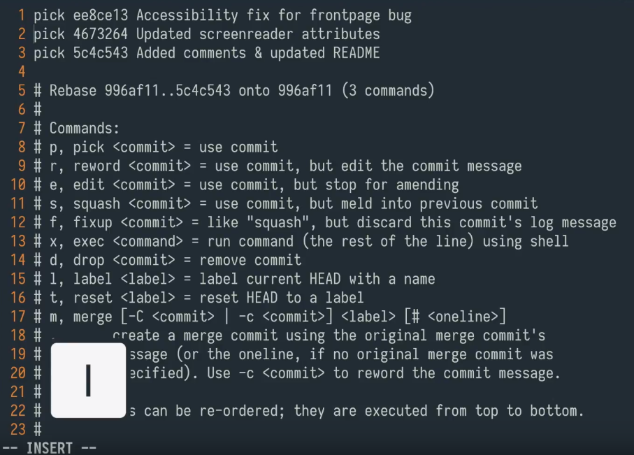 1이 가장 최신 commit이다
        - squash 할 commit 앞부분을 수정 후 저장 
            - 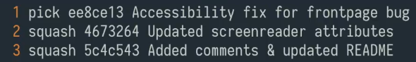
        - 이후 commit message 설정하는 창이 떠서 수정하면 된다. 
            - 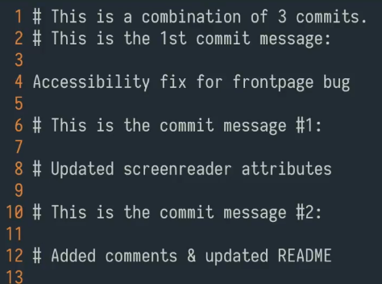


## 코드리뷰 프로세스 

1. 작업할 target branch checkout
    * 일반적으로 develop
    * 공동 개발 feature 브랜치가 있을 경우 해당 feature branch : ex) feature/cuman
2. 개인 feature branch 생성 (git flow 이용 추천)
    * 본인의 아이디를 붙여서 공용 브랜치와 구분한다. (git flow 사용시 ```user-name/feature-name``` 입력)
    * 기본적으로 모든 개인 개발은 공용 branch에 바로 commit 하지 않고, 개인 feature 브랜치에 commit 한다.  
        ex) ```feature/ppodoru/XXX-bug-fix``` (target:develop)  
        ex) ```feature/ppodoru/cuman-feature1``` (target:feature/cuman)
3. 작업이 완료되면 target 공용 브랜치로 rebase를 한번 해준다.
    * ```git rebase develop```
    * rebase하는 도중 conflict가 날 수 있고, 이 경우 conflict 해결한다.
    * ```git push``` or ```git push -f``` : rebase를 하게 되면 강제 푸시를 해야 하는 경우도 있다.  
        SourceTree UI에서는 강제 푸시가 안 된다.   
        SourceTree의 Terminal 버튼을 통해서 Terminal 하나 열고 ```git push -f``` 실행
    * 작업 완료되기 이전에도 conflict를 줄이기 위해서 주기적으로 target branch로 rebase 해주는 것을 추천*
4. GitHub UI 에서 Pull Request 생성
    * ex) base: develop ... compare: feature/ppodoru/XXX-bug-fix
    * 리뷰어가 참고할 내용을 입력하고 리뷰 요청
    * Assignee, Milestone, Labels 등도 잘 달아준다.
    * 리뷰어를 한명 배정하고, 그 외 추가 리뷰가 필요할 경우에는 comment에 mention(@id)를 이용하여 요청한다.
5. 리뷰어가 리뷰 진행
    * 요청자에게 필요한 부분 피드백 주고, 필요한 경우 요청자는 수정해서 개인 feature 브랜치로 다시 push 한다.
    * jenkins와 연동되어서 pull request 가 생성되면 자동으로 test 빌드가 수행된다. 리뷰시 test 결과도 항상 확인을 해준다.
    * test 결과는 나오는데 조금 시간이 걸릴 수 있기 때문에 결과가 아직 없을 경우 나올때까지 기다려준다.
6. 리뷰 완료
    * 리뷰가 완료되면 리뷰어가 **Merge pull request** 실행.
    * **Confirm merge** 실행후, **Delete branch** 를 실행해서 기존 개인 feature 브랜치는 바로 삭제되도록 한다.
    * 요청자의 local에 있는 feature 브랜치는 자동으로 삭제되지 않으므로 요청자가 따로 삭제를 진행한다.

#### 긴급하게 수정 및 적용이 필요해서 리뷰를 받기 힘든경우 (**선반영** 프로세스)
* 요청자가 바로 merge를 실행한다.
* 해당 요청은 바로 close로 바뀌겠지만, 리뷰어는 추후 리뷰를 진행하고 의견을 달아준다.
* 수정이 필요한 경우 요청자는 의견에 대해서 다시 feature 브랜치를 따서 작업을 진행한다.
* 기본적으로 선반영을 하는 경우는 최소화 하도록 노력한다.


## Gitflow
굳이 gitflow 사용할 필요는 없지만, git extensions을 지원하여서 보다 high-level repository operations 할 수 있도록 지원해준다.


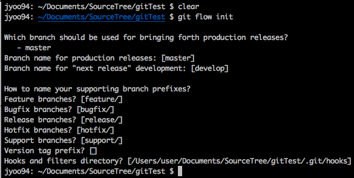
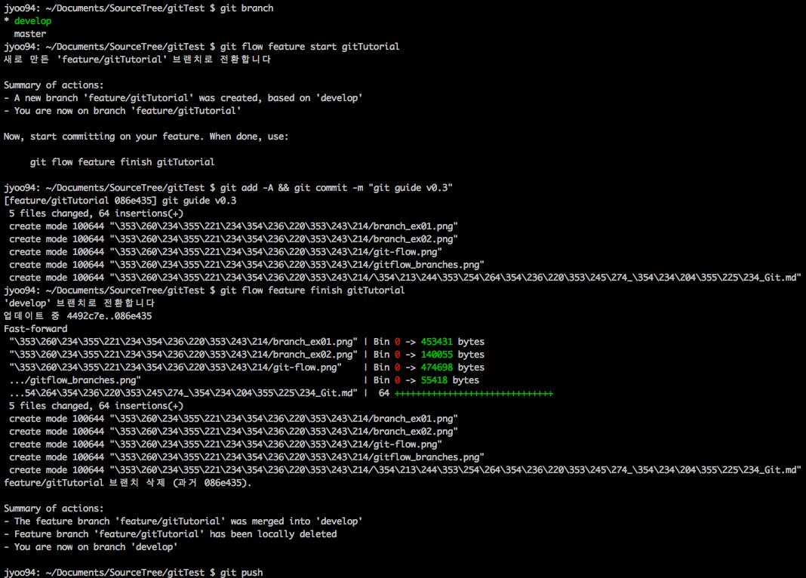
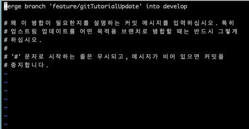

```
git status
git flow feature start gitTutorialUpdate
git add -A && git commit -m "git guide update"
git flow feature finish gitTutorialUpdate
```

### 버전관리가 필요하지 않으면 굳이 사용할 필요는 없다. 하지만, 큰 단점이 존재 
- git flow feature finish를 사용하면 merge message와 함께 바로 develop 브랜치에 merge가 된다. (PR이 없다)
    - PR을 git 페이지에서 보내고 merge 할때만 저 명령어를 사용한다
    - finish만 사용하지 않는다.

#### 참조: finish 역할 
1. **Merges** gitTutorialUpdate into 'develop'
2. **Removes** the feature branch (gitTutorialUpdate)
3. **Switches** back to 'develop' branch

<br>

## PR으로 Issue 자동으로 닫게 하기 기능
Pull Request (PR)에 다음과 같은 명령어와 함께 #21 하면 Merge할 때 자동으로 issue도 닫힌다. (단 영어만 지원)
- close
- closes
- closed
- fix
- fixes
- fixed
- resolve
- resolves
- resolved


예) fix #1 
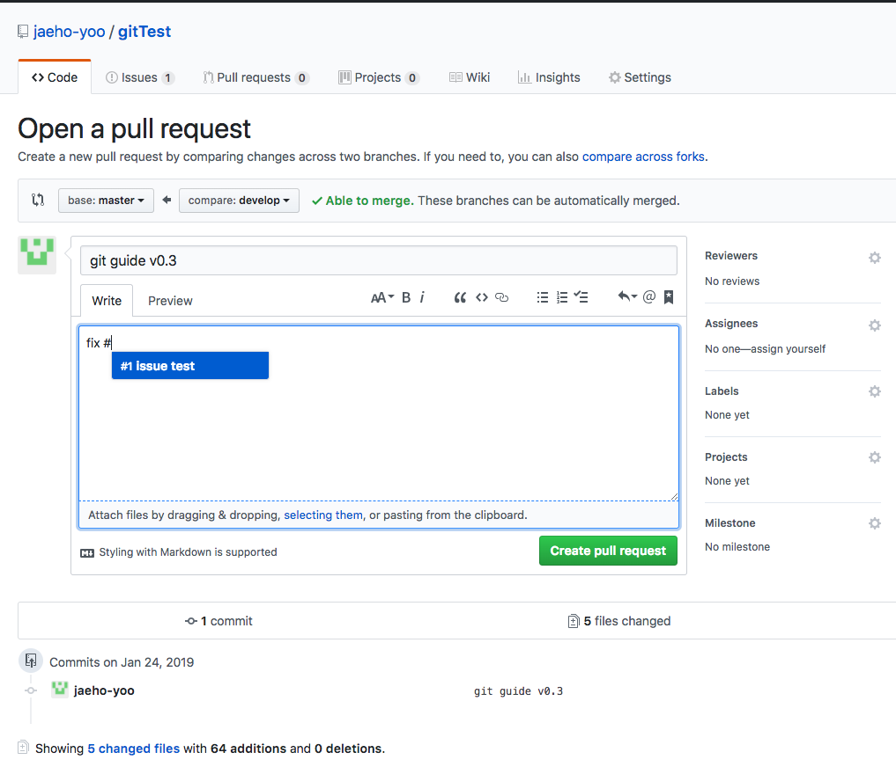
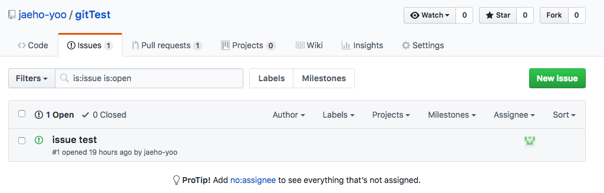
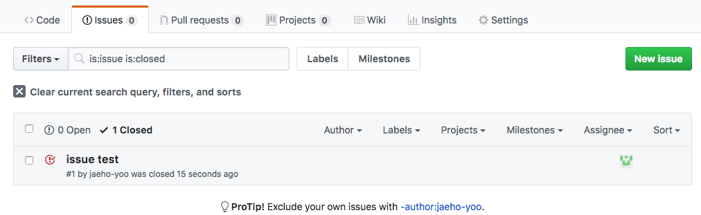

```
github에서 issue 남기기 + issue 번호 얻기 
git push 및 pull request 날리기 (내용에 fix #issue번호 적기)
```

#### 만약에 merge 대상 branch가 dev여도 가능합니다.

## 흔한 Git 문제 및 해결 방법
[Git Tutorial: 10 Common Git Problems and How to Fix Them](https://www.codementor.io/citizen428/git-tutorial-10-common-git-problems-and-how-to-fix-them-aajv0katd) 참조

1. 작업한 내용 삭제 (마지막 commit 상태로 복구)
``` 
git checkout -- test.md # reset specified path or file  git checkout -- 발표자료
git checkout -- lib bin # also works with multiple arguments
```
#### CMD
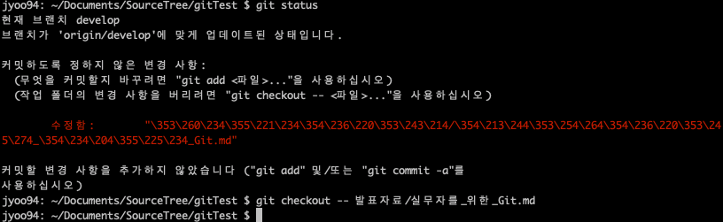

#### Sourcetree
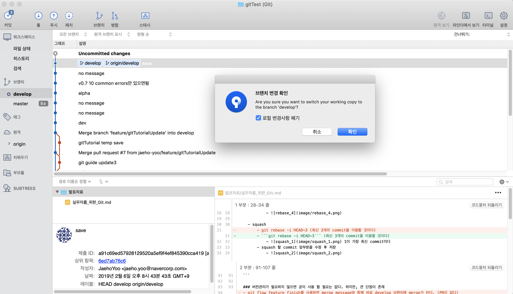

2. Undo local commits 
```
git reset HEAD~2        # undo last two commits, **keep changes**
git reset --hard HEAD~2 # undo last two commits, **discard changes** 
```

3. Git에 파일 제외 (git add 됐을 경우)
```
git reset filename          # or git remove --cached filename
echo filename >> .gitignore # add it to .gitignore to avoid re-adding it
```

4. (가장 최근) Commit message 수정 
- 참고 : amend 라는 명령어는 새로 commit을 하기에 이미 OSS에 push 했으면 사용하지 않기
```
git commit --amend                  # start $EDITOR to edit the message
git commit --amend -m "New message" # set the new message directly
```

5. Push하기 전에 local commit message 수정
- git rebase + squash 하기 (위 rebase 참조)
```
git rebase -i HEAD~3
```

6. Reverting pushed commit
```
git revert c761f5c              # id
git revert HEAD^                # 마지막 2번째 commit revert
git revert develop~4..develop~2 # 해당 범위 revert
```

Revert 하는 commit을 생성하기 싫을 경우
```
git revert -n HEAD
```

7. 반복적인 merge conflicts 자동화 - [git rerere](https://git-scm.com/book/en/v2/Git-Tools-Rerere)
```
git config --global rerere.enabled true
```

8. 버그 찾기 ([git bisect documentation](https://git-scm.com/docs/git-bisect)) [가이드 영상](https://www.youtube.com/watch?v=P3ZR_s3NFvM)
- 2진 검색 알고리즘 (binary search algorithm)을 이용하여 사용자의 판단하에 버그 찾기
- commit 정보 제공 (commit 아이디, 사용자, 날짜, commit message, 변경된 파일)

```
git bisect start
git bisect good 4492c7e9cb6ab817b4385d4e2fdec11745e17d8b
git bisect bad  # default가 현재 commit 이고, 지정 해줄 수도 있다

git bisect good/bad # 해당 commit을 찾을 때까지 반복

git bisect reset
```
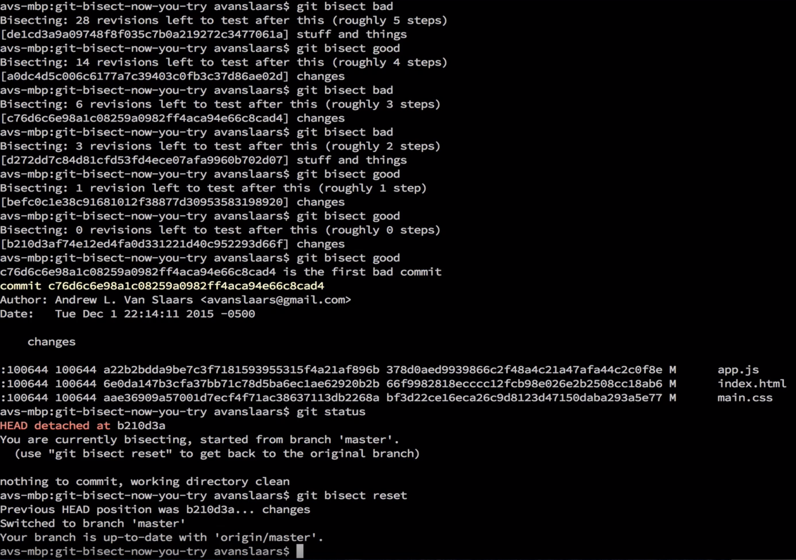


9. [Git hook](https://git-scm.com/docs/githooks)을 이용해서 common mistakes 방지하자 [가이드 영상](https://www.youtube.com/watch?v=MF72e-12dxE)
- Git hook 이란 : script로 지정한 순간에 git이 script를 작동하여 script 결과에 따라서 commit이 가능/거절 된다.
- 기본적으로 git 생성시에 ```<project>/.git/hooks/``` 폴더에 생기지만, project를 clone하면 생기지 않기에 ```git config core.hooksPath hooks``` 식으로 hooks 폴더를 따로 생성해서 설정이 가능하다


10. 특정 data 완전히 삭제 [가이드 사이트](https://help.github.com/articles/removing-sensitive-data-from-a-repository/) [가이드 영상](https://www.youtube.com/watch?v=wFfqKzrpWeY)
Repository 기록을 수정하고 data 관련 commit의 SHAs 을 모두 수정


참조 자료:
- [Git revert](https://www.theserverside.com/tutorial/How-to-git-revert-a-commit-A-simple-undo-changes-example)
- [Git top 20 명령어 정리](https://dzone.com/articles/top-20-git-commands-with-examples)
- [Code review process](http://cuve.navercorp.com/doc/admin/code-review-process/#_1)
- [PR로 Issue 닫기](https://github.blog/2013-05-14-closing-issues-via-pull-requests/)
- [Git-flow](https://jeffkreeftmeijer.com/git-flow/)
- [10 common git problems](https://www.codementor.io/citizen428/git-tutorial-10-common-git-problems-and-how-to-fix-them-aajv0katd)
