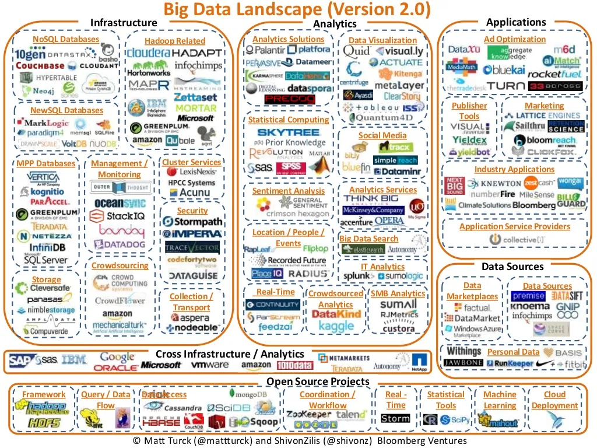
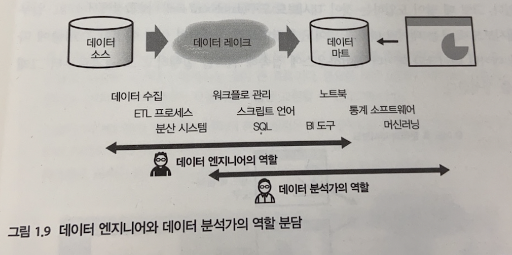
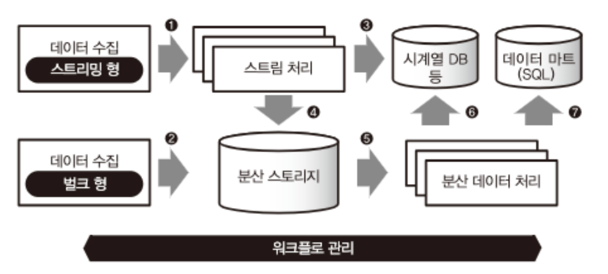
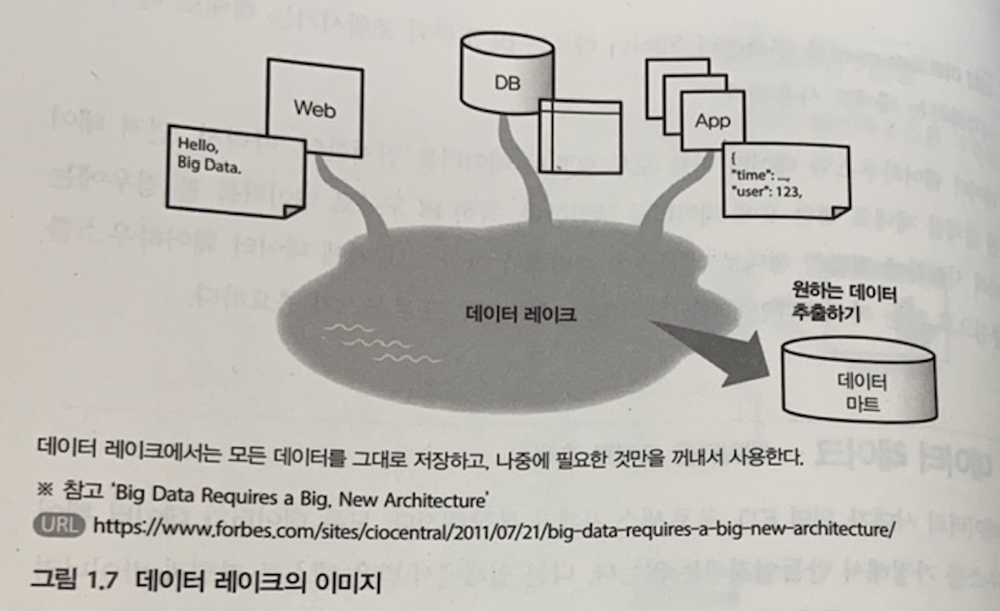
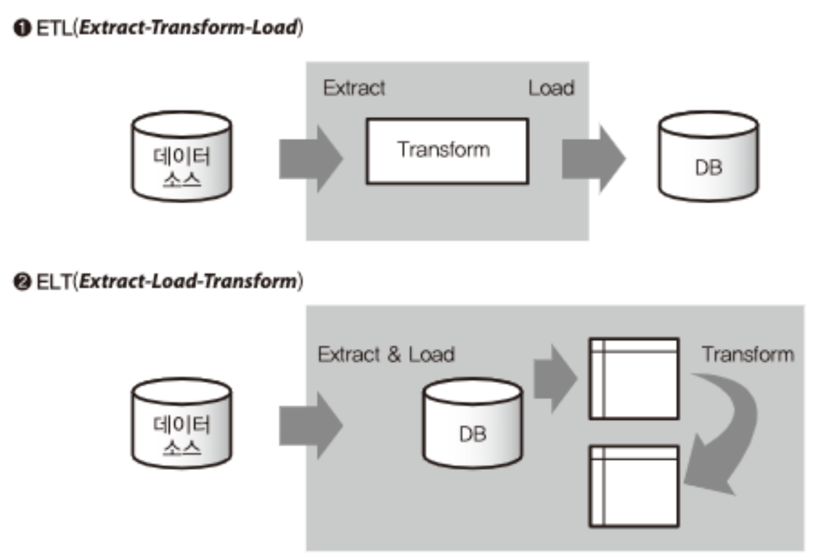
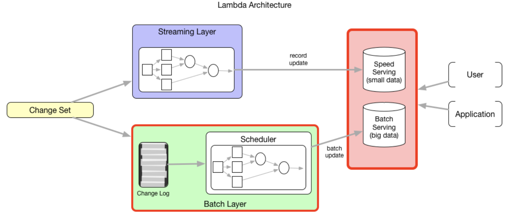
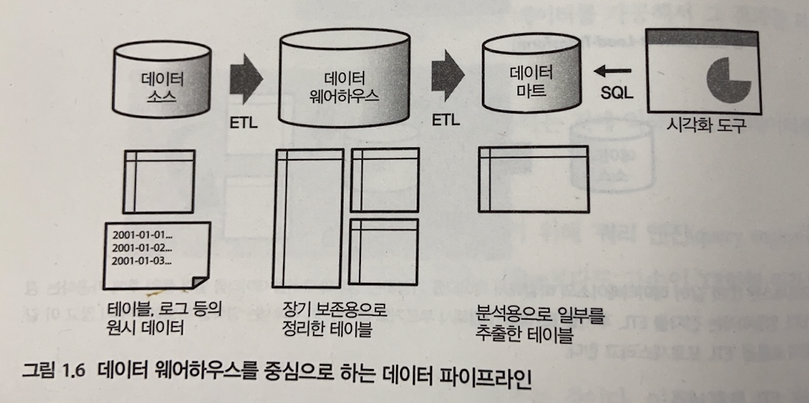

# 02. 데이터 엔지니어링 개념 및 역할

## 데이터 엔지니어링이란?

**데이터 엔지니어링**은 **분산 시스템을 활용해서 데이터를 순차적으로 가공해 나가는 구조**를 다루는 일입니다.

- 빅데이터 기술이 기존 데이터 웨어하우스와 다른 점은, **여러 분산 시스템을 조합해 확장성이 좋은 데이터 처리 구조**를 만든다는 것입니다.
- 실제로는 **데이터 파이프라인**처럼 여러 서브 시스템(수집 → 저장 → 처리 → 분석·시각화)을 조합해 구현합니다.
- 파이프라인에서 하고 싶은 일이 늘어날수록 시스템은 복잡해지고, **어떤 도구를 어떻게 조합할지**가 핵심이 됩니다.

**데이터 생태계는 해마다 크게 바뀝니다.** 아래 MAD(Machine Learning, Analytics, Data) 맵은 2012년과 2024년을 비교한 것으로, 도구와 레이어가 얼마나 많이 변하는지 보여 줍니다. “변하는 게 많다”는 걸 염두에 두고, 한 번 배운 걸로 끝이 아니라 **공식 문서·영어 자료를 계속 보는 습관**이 중요합니다.

**데이터의 여정**

> 💡 Mermaid는 GitHub, GitLab, VS Code(확장), Notion 등에서 글을 자동으로 그림으로 보여줍니다.

---

## 데이터 사이언티스트 vs 데이터 엔지니어 vs 데이터 분석가

세 역할 모두 데이터를 다룬다고 해도, **요구하는 지식과 사용하는 도구가 다릅니다**.  
먼저 용어를 구분하고, “내가 무엇을 하고 싶은지” 목표를 정한 뒤 공부하는 것이 좋습니다.

| 구분          | 데이터 사이언티스트                    | 데이터 엔지니어                                                          | 데이터 분석가                                                                        |
| ------------- | -------------------------------------- | ------------------------------------------------------------------------ | ------------------------------------------------------------------------------------ |
| **역할**      | 통계·ML 이론 기반의 **분석 모델 개발** | 대용량 데이터의 **수집/유지/관리**, 그를 위한 **소프트웨어·시스템 구축** | **문제 정의**, 데이터 탐색, **보고서·시각화**로 인사이트를 도출해 비즈니스 문제 해결 |
| **필요 기술** | 통계, 수학, 머신러닝, R 또는 Python    | 데이터 저장소(SQL·NoSQL), Hadoop·Spark 등 분산 프레임워크                | 통계 프로그램(R, SAS, SPSS, STATA 등), 시각화·리포팅                                 |
| **전공 예시** | 수학, 경제, 컴퓨터과학, 물리           | 컴퓨터과학, 공학                                                         | 경영, 경제, 통계                                                                     |

- **데이터 엔지니어**는 시스템의 **구축·운용·자동화**를 담당합니다.
- **데이터 분석가**는 “데이터에서 가치 있는 정보를 추출”하는 쪽에 가깝고, 사용하는 도구도 다릅니다.
- JD(채용 공고)를 보면 역할이 비슷해 보여도 실제로는 다르게 요구하는 경우가 많습니다.

_그림: 빅데이터를 지탱하는 기술, 1장 (니시다 케이스케, 제이펍)_

---

## 데이터 파이프라인의 구성 요소

**데이터 파이프라인(pipe-line)** 은 “데이터가 흘러가는 시스템”입니다.  
다음 단계들이 조합되어 하나의 파이프라인이 됩니다.

### 1. 데이터 수집

- **벌크(bulk)형**: 이미 존재하는 데이터를 정리해 추출. DB·파일 서버 등에서 **정기적으로** 수집할 때 사용.
- **스트리밍(streaming)형**: 계속 생성되는 데이터를 **끊임없이** 전송. 모바일 앱, 센서 등에서 발생하는 데이터 수집에 사용.

_그림: 빅데이터를 지탱하는 기술, 1장 (니시다 케이스케, 제이펍)_

### 2. 데이터 저장

**데이터 타입에 따른 저장 방식:**

- **정형 데이터 (Structured Data)**: 행과 열로 구조화된 데이터 (예: 엑셀, DB 테이블)
  - → **데이터 웨어하우스 (Data Warehouse)**: 정형 데이터를 장기 보존하는 데 최적화. 한 번에 대량 전송에 강함
  - → **데이터 마트 (Data Mart)**: 웨어하우스에서 필요한 데이터만 추출해 분석·시각화용으로 구축

- **비정형 데이터 (Unstructured Data)**: 정해진 구조가 없는 데이터 (예: 로그, JSON, 이미지, 영상)
  - → **데이터 레이크 (Data Lake)**: 원시 데이터를 있는 그대로 축적해 두고, 나중에 필요에 따라 가공하는 구조

**인프라:**

- **분산 스토리지**: 여러 컴퓨터·디스크로 구성된 스토리지 (예: 객체 스토리지 S3, HDFS)

_그림: 빅데이터를 지탱하는 기술, 1장 (니시다 케이스케, 제이펍)_

_그림: 빅데이터를 지탱하는 기술, 1장 (니시다 케이스케, 제이펍)_

### 3. 데이터 처리

- **배치 처리**: 어느 정도 모인 데이터를 효율적으로 가공. 장기 분석·대량 집계에 적합.
- **스트림 처리**: 실시간으로 들어오는 데이터를 연속 처리. “지금 무슨 일이 일어나는지” 바로 보고할 때 사용.
- **쿼리 엔진**: 분산 스토리지 위에서 SQL로 집계 (예: Hive, Trino).
- **ETL(Extract–Transform–Load)**: 원시 데이터를 추출·가공한 뒤 웨어하우스 등에 적재하는 과정.

_그림: 빅데이터를 지탱하는 기술, 1장 (니시다 케이스케, 제이펍)_

**왜 배치와 스트림을 나눠서 설명했을까?**

실제 시스템에서는 **두 개 다 필요**하기 때문입니다.

- **배치**: 모인 데이터를 정기적으로 분석 (예: 일일 매출 집계)
- **스트림**: 실시간으로 들어오는 데이터를 즉시 처리 (예: 실시간 대시보드)

**문제는**: 초창기에는 실시간이라는 게 없었고 배치만 있었습니다 (Hadoop MapReduce). 나중에 실시간 처리 필요성이 생겼지만, 당시 기술로는 **하나의 시스템으로 배치와 스트리밍을 모두 처리하기 어려웠습니다**.

그래서 두 개를 따로 만들 수밖에 없었습니다:

- 배치는 배치 시스템으로 (Hadoop)
- 스트리밍은 스트리밍 시스템으로 (Storm, Kafka 등)

> **Q. 배치를 엄청 자주 돌리면 (예: 1분마다) 스트림처럼 되지 않나요?**
>
> 이론적으로는 비슷해 보이지만, 실제로는 차이가 있습니다:
>
> - **상태 관리**: 스트림은 연속적인 상태 유지가 자연스럽지만, 배치는 매번 새로 시작
> - **리소스 효율**: 배치를 자주 돌리면 매번 시작/종료 오버헤드 발생
> - **레이턴시**: 배치는 아무리 자주 해도 최소 몇 초~몇 분 지연. 스트림은 밀리세컨드 단위
>
> 이런 차이들 때문에, 정말 실시간이 필요한 경우는 **배치와 다른 시스템을 구현해야 했습니다**.

### 4. 데이터 분석

- 수집·처리된 데이터를 집계·요약해 인사이트를 추출합니다.
- **쿼리 엔진** (예: [Hive](https://github.com/apache/hive), [Trino](https://github.com/trinodb/trino)): 분산 스토리지 위에서 SQL로 대량 데이터 집계
- **BI 도구** (예: [Tableau](https://github.com/Tableau-Desktop-Download), [Superset](https://github.com/apache/superset)): 분석 결과를 시각화·대시보드로 제공

### 5. 데이터 활용

- 분석 결과를 실제 서비스·의사결정에 적용합니다.
- **추천 시스템**, **이상 감지**, **머신러닝 피처 스토어** 등
- 데이터 엔지니어는 분석가·사이언티스트가 활용할 수 있도록 **데이터를 정제·제공**하는 역할을 합니다

---

## 데이터 처리 아키텍처 (Lambda → Kappa → Kappa+)

그럼 배치와 스트림을 어떻게 조합할 것인가? 아키텍처가 발전해왔습니다.

#### Lambda 아키텍처 (2010년대 초반)

**배치 레이어**와 **스트리밍 레이어**를 **따로 두는** 구조입니다.

- 실시간은 스트리밍 레이어
- 전체/역사 데이터는 배치 레이어
- 서빙 레이어에서 두 결과를 합침

**문제점**: 두 파이프라인을 함께 유지해야 해서 복잡하고, 로직이 두 갈래로 나뉘는 부담이 있습니다.

#### Kappa 아키텍처 (개선)

Lambda의 복잡성을 해결하기 위해 **스트림 하나**로 통일합니다.

- 변경 데이터(Change Set)와 변경 로그(Change Log)를 한 **스트림 프로세서**에서 처리
- 같은 로직으로 최근 데이터(Speed Serving)와 역사 데이터(Batch Serving)를 모두 처리
- 배치도 "스트림 재재생"으로 처리

**장점**: Lambda보다 단순하고 일관되게 유지하기 쉽습니다.

**단점**:

- **데이터 재처리 복잡**: 스트림 로그를 처음부터 재재생해야 하므로 백필(backfill)이 어렵습니다
- **정확히 한 번 보장 어려움**: 스트림 처리 중 장애 발생 시 중복/누락 처리 문제
- **지연 도착 데이터**: 늦게 도착한 데이터를 어떻게 처리할지 복잡

#### Kappa+ (최신 발전)

Kappa의 단점을 보완하기 위해 더 고도화된 기능들을 추가한 형태:

- **지연 도착 데이터 처리**: 늦게 도착한 데이터도 정확히 처리
- **정확히 한 번 처리(exactly-once)**: 중복/누락 없이 정확히 한 번만 처리
- **상태 관리·백필**: 상태를 안전하게 관리하고 과거 데이터 재처리 지원

Apache Flink처럼 스트림을 기본으로 하면서 배치를 "유한 스트림"으로 다루는 방식이 이 흐름에 포함됩니다.

_위 그림들: 데이터 적재·처리 아키텍처 비교 (Lambda vs Kappa)_

**출처**: [Incremental Processing on the Data Lake \| Apache Hudi](https://hudi.apache.org/blog/2020/08/18/hudi-incremental-processing-on-data-lakes/).

- Lambda/Kappa/Kappa+ 및 데이터 레이크 증분 처리에 대한 자세한 내용은 위 글을 참고하면 됩니다.

## 워크플로 관리

- 정해진 시간에 배치 실행, 파이프라인 실행 순서 제어, 오류 시 알림 등 **전체 파이프라인의 동작을 관리**하는 기술.
- 수집 → 저장 → 처리 → 분석 → 활용의 흐름이 자동으로 돌아가도록 **오케스트레이션**하는 역할.
- 대표적으로 [Apache Airflow](https://github.com/apache/airflow), [Dagster](https://github.com/dagster-io/dagster) 등이 있습니다.

---

## 실무에서의 역할과 책임

**데이터 엔지니어**는 주로 다음을 담당합니다.

- 대용량 데이터의 **수집·유지·관리**
- 이를 위한 **소프트웨어 개발**과 **시스템 구축**
- 분산 스토리지·분산 처리 프레임워크(Hadoop, Spark, Flink 등)를 이용한 **파이프라인 설계·운영**
- 데이터가 “어디서 모이고, 어떻게 가공되어, 어디로 나가는지”를 설계하고 **자동화**하는 것

실제 서비스에서는 **데이터 레이크·웨어하우스·마트**를 어떻게 나누고, **배치와 스트림**을 어떻게 섞을지가 중요한 판단이 됩니다.

_그림: 빅데이터를 지탱하는 기술, 1장 (니시다 케이스케, 제이펍)_

---

## 핵심 개념 정리

- **데이터의 여정**: 수집 → 저장 → 처리 → 분석 → 활용
- **데이터 엔지니어의 역할**: 이 여정을 가능하게 하는 **파이프라인 구축 및 관리**.
- **실제 사례**: 넷플릭스, 우버 등은 대규모 데이터 파이프라인을 운영하며 추천·실시간 분석 등을 제공합니다.

---

## 참고

- [네이버 검색 AI·데이터 플랫폼 소개](https://naver-career.gitbook.io/kr/service/search/ai-and-data-platform) — 데이터 플랫폼에서 어떤 일을 하는지 예시.
- 도서: _빅데이터를 지탱하는 기술_ (니시다 케이스케, 제이펍) — 1장 “빅데이터의 기초 지식” 등.
- [03_빅데이터_분산처리.md](03_빅데이터_분산처리.md) — 다음 단계: 빅데이터와 분산 처리 개념.

---

## 그림 출처

본 문서에 수록된 그림은 다음 도서에서 인용하였습니다.

| 그림 파일                   | 설명                               | 출처                                                                                                                                        |
| --------------------------- | ---------------------------------- | ------------------------------------------------------------------------------------------------------------------------------------------- |
| data_roles.png              | 데이터 역할 구분                   | _빅데이터를 지탱하는 기술_ 1장, 니시다 케이스케, 제이펍                                                                                     |
| data_transfer.png           | 데이터 전송(벌크/스트리밍)         | 동일                                                                                                                                        |
| data_terminology.png        | 데이터 웨어하우스·마트·레이크 용어 | 동일                                                                                                                                        |
| data_lake.png               | 데이터 레이크 개념                 | 동일                                                                                                                                        |
| etl.png                     | ETL 프로세스                       | 동일                                                                                                                                        |
| data_warehouse_pipeline.png | 데이터 웨어하우스 파이프라인       | 동일                                                                                                                                        |
| lambda_architecture.png     | Lambda 아키텍처                    | [Apache Hudi — Incremental Processing on the Data Lake](https://hudi.apache.org/blog/2020/08/18/hudi-incremental-processing-on-data-lakes/) |
| kappa_architecture.png      | Kappa 아키텍처                     | 동일 (자세한 내용은 위 링크 참고)                                                                                                           |
| MAD_2012.png, MAD_2024.png  | MAD 맵 (2012 vs 2024)              | 강의 보조 자료                                                                                                                              |

---

## 참고 · 더 알아보기

- **Data Engineer Roadmap** — 데이터 엔지니어가 다루는 도구·역할을 한눈에 보는 로드맵. 그림이 잘 정리되어 있어 학습 방향 참고용으로 활용하기 좋습니다.  
  [GitHub: datastacktv/data-engineer-roadmap](https://github.com/datastacktv/data-engineer-roadmap)
