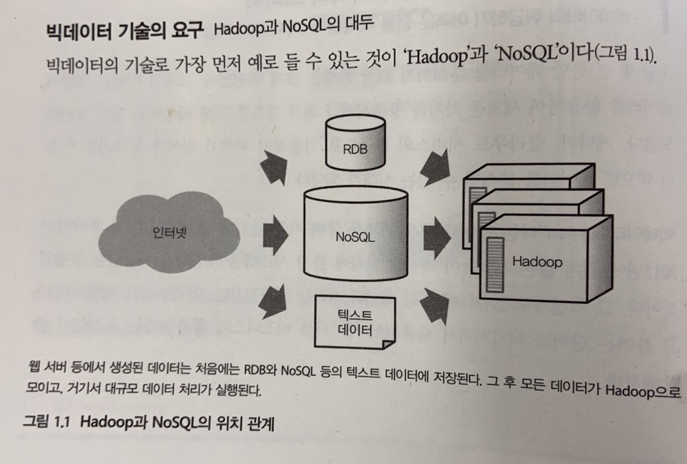
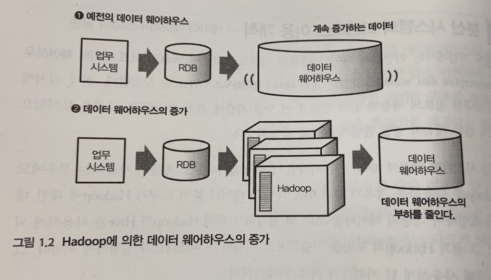

# 03. 빅데이터와 분산 처리 개념

## 빅데이터의 3V (Volume, Velocity, Variety)

- **Volume(양)**: 처리해야 할 데이터의 규모가 크다.
- **Velocity(속도)**: 데이터가 빠르게 생성·유입된다.
- **Variety(다양성)**: 정형뿐 아니라 비정형 데이터도 다룬다.

이런 특성 때문에 단일 서버로는 한계가 있고, **분산 시스템**이 필요해졌습니다.

---

## 빅데이터는 언제부터? — 짧은 역사

‘빅데이터’라는 말이 대중에 자주 등장한 것은 **2011년 후반~2012년** 무렵, 많은 기업이 데이터 처리에 **분산 시스템**을 도입하기 시작했을 때입니다.  
“많은 양의 데이터를 처리할 수 있게 되면서” 빅데이터가 화두에 올랐다고 보면 됩니다.

### 연도별로 보는 정착 과정

- **~2011년**: Hadoop, NoSQL 등 **기반 기술** 발전.
- **~2012년**: 클라우드형 **데이터 웨어하우스**, **BI 도구** 보급.
- **2013년~**: **스트림 처리**, **애드혹(ad hoc) 분석** 환경 확대.

### MySQL 샤딩 — 분산 스토리지의 시작

정확한 시기는 모르지만, **2012년 이후부터 MySQL Sharding 기술이 유행**하기 시작한것 같네요.  
“한 덩어리 DB를 여러 조각으로 나누어 부하를 나누는” 방식으로, **분산 스토리지/DB의 초창기 형태** 중 하나라고 볼 수 있습니다.

- **Sharding(샤딩)**: “조각”이라는 뜻으로, **큰 것을 나누어 여러 곳에 두는 것**을 말합니다.
- **실제 사례**
  - [G마켓 — MySQL 샤딩 적용 사례](https://dev.gmarket.com/61)
  - [2024년 카카오 — MySQL DB 샤딩 적용 사례](https://if.kakao.com/2024/session/time-table?tab=d3)

RDB 한 대의 한계를 느끼는 회사들이 "우선 DB를 나눠서 확장해 보자"는 식으로 도입한 경우가 많습니다.

> 💡 **이제 더 이상 안 쓰는 기술인가요?**  
> 아닙니다! **상황에 따라 지금도 많이 사용하고 있습니다**. HDFS, NoSQL 같은 분산 시스템이 나왔지만, MySQL 샤딩이 더 적합한 경우도 많습니다 (예: 트랜잭션이 중요한 서비스, 기존 MySQL 인프라 활용).

---

## 왜 분산 처리가 필요한가?

빅데이터를 다루기 **어렵다고 느끼는 이유**는 크게 두 가지입니다.

1. **데이터의 분석 방법을 모른다**  
   → 데이터가 있어도 **가치를 창출하지 못하면** 의미가 없다.
2. **데이터 처리에 시간과 수고가 많이 든다**  
   → 지식이 있어도 **한 번에 처리할 수 있는 양**이 제한되면 할 수 있는 일이 줄어든다.

이를 극복하기 위해 **분산 시스템**을 쓰게 됩니다.  
여러 대의 컴퓨터로 **저장과 계산을 나누어** 처리하면, 단일 서버만 쓸 때보다 **많은 양**을 **상대적으로 빠르게** 다룰 수 있습니다.

- **단일 서버의 한계**: 스펙을 올려도(CPU, 메모리, 디스크) 결국 한 대의 상한이 있다.
- **분산 시스템**: **여러 대를 묶어** 저장·처리하므로, 필요에 따라 **대수를 늘리는 방식**으로 확장할 수 있다.

---

## 수직 확장 vs 수평 확장

- **수직 확장(Scale up)**  
  한 대의 서버 성능을 높이는 것 (CPU, 메모리, 디스크 증설).  
  단순하지만 **비용과 물리적 한계**가 있고, 한 대가 죽으면 전체가 멈춘다.

- **수평 확장(Scale out)**  
  **서버 대수를 늘려** 처리 능력과 저장 용량을 키우는 것.  
  빅데이터에서는 보통 이 방식으로 확장하며, **분산 스토리지·분산 처리** 프레임워크(Hadoop, Spark 등)가 이 모델을 전제로 한다.

---

## 분산 시스템의 기본 원리 — Hadoop과 NoSQL

빅데이터 기술이 “현실적인 비용으로 대규모 처리”를 가능하게 한 대표 조합은 **Hadoop + NoSQL**입니다.  
**2011년 후반**쯤 이런 구조가 정착했습니다.

*그림: 빅데이터를 지탱하는 기술, 1장 (니시다 케이스케, 제이펍)*

- **Hadoop**  
  **저장**할 스토리지(HDFS)와 **저장된 데이터를 모아서 집계**하는 분산 처리(MapReduce 등)를 제공.  
  → “저장 후 **배치로 집계**하는 분산 처리”에 쓰인다.

- **NoSQL**  
  전통 RDB의 제약을 줄이고, **빈번한 읽기/쓰기**와 **분산**에 맞춘 DB들의 총칭.  
  키-밸류, 도큐멘트, 와이드 컬럼 스토어 등 여러 형태가 있다.  
  → “**온라인**으로 접근할 때 분산해서 읽고 쓰는” 용도에 쓰인다.

정리하면:

- **하둡**: 대량 데이터를 저장하고, 나중에 **한꺼번에 분산 처리(집계)**.
- **NoSQL**: **실시간/온라인** 접근이 필요한 데이터를 **여러 노드에 나누어** 저장·조회.

기존 데이터 웨어하우스(DWH)만으로는 확장성 한계가 있어, **하둡에서 전처리·저장**하고 **중요한 데이터만 DWH에** 넣어 분석하는 식으로 쓰이기도 합니다.

*그림: 빅데이터를 지탱하는 기술, 1장 (니시다 케이스케, 제이펍)*

초기 Hadoop은 MapReduce를 **자바로 직접** 짜야 해서 진입 장벽이 있었고, 그래서 **Hive**처럼 “SQL을 하둡 위에서 실행”하는 쿼리 엔진이 등장했습니다.  
(참고: [2004년 12월, Google MapReduce 논문](https://static.googleusercontent.com/media/research.google.com/ko//archive/mapreduce-osdi04.pdf))

---

## 핵심 개념 정리

- **빅데이터의 정의와 특징**: 3V(Volume, Velocity, Variety); 단일 서버로는 한계가 있어 분산 시스템이 필요해짐.
- **단일 서버의 한계**: 수직 확장의 한계, 장애 시 전체 중단.
- **분산 시스템의 장점**: 수평 확장으로 양과 처리량 확대; 단, 설계·운영 복잡도와 장애 대응(일부 노드 장애 등)이라는 **과제**가 있음.
- **실제 사례**: YouTube, 카카오톡, G마켓, 카카오 MySQL 샤딩 등 — 대량 트래픽·데이터를 분산 저장·처리로 감당.

---

## 참고

- 도서: *빅데이터를 지탱하는 기술* (니시다 케이스케, 제이펍) — 1장 “빅데이터의 기초 지식”, 1.1절 “빅데이터의 정착”.
- [G마켓 기술 블로그 — MySQL 샤딩](https://dev.gmarket.com/61)
- [카카오 if.kakao 2024 — MySQL DB 샤딩 적용](https://if.kakao.com/session/time-table?t.RVmWsFVgRd=2)
- [04_Linux_기본명령어.md](04_Linux_기본명령어.md) — 다음 단계: Linux 기본 명령어 학습.

---

## 그림 출처

본 문서에 수록된 그림은 다음 도서에서 인용하였습니다.

| 그림 파일 | 설명 | 출처 |
|-----------|------|------|
| hadoop.jpeg | Hadoop — 다수의 컴퓨터에서 대량의 데이터 처리 | *빅데이터를 지탱하는 기술* 1장, 니시다 케이스케, 제이펍 |
| data_warehouse_size.jpeg | 데이터 웨어하우스와 하둡 규모 비교 | 동일 |
