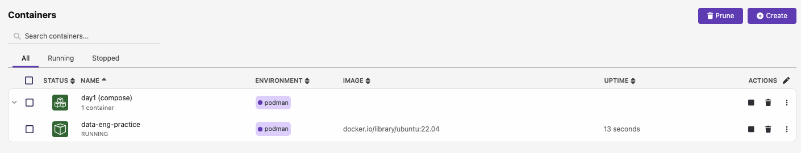

# 06. Docker 환경 구성

## 실습 목표

**컨테이너**(Docker 호환)로 데이터 엔지니어링 실습에 쓸 **동일한 Linux 환경**을 빠르게 만듭니다.  
이미지 한 번 받아 두면 다른 PC·서버에서도 같은 환경을 재현할 수 있어, “내 컴퓨터에서는 되는데…” 문제를 줄이는 것이 목표입니다.

**이 실습은 Podman 기준으로 진행합니다.** 강의자는 Docker Desktop이 없어(기업 라이선스 이슈) **Podman**을 사용합니다. 아래 명령어는 모두 `podman`·`podman compose` 기준입니다.
**Docker를 쓰는 수강생**은 `podman` → `docker`, `podman compose` → `docker compose`(또는 `docker-compose`)로 치환해 따라 하시면 됩니다.

---

## ⚠️ 시스템 요구사항

본 실습(특히 Day2 HDFS, Day3 Spark)을 원활하게 진행하려면 다음 시스템 사양이 필요합니다:

### 최소 요구사항

- **메모리(RAM)**: **최소 6GB 이상** (8GB 이상 권장)
- **디스크 공간**: 20GB 이상 여유 공간
- **CPU**: 2코어 이상 (4코어 이상 권장)

### 메모리가 부족한 경우

**증상:**

- 컨테이너가 느리게 실행되거나 갑자기 종료됨
- 시스템이 멈추거나 응답 없음
- "Out of memory" 에러 발생

**해결 방법:**

1. **다른 프로그램 종료**하여 메모리 확보
2. **Podman Desktop/Docker의 메모리 할당량 증가**
   - Podman Desktop: Settings → Resources → Memory 설정
   - Docker Desktop: Settings → Resources → Memory 설정
3. **Worker 리소스 줄이기** (docker-compose.yml 수정)
   - Worker 수 감소
   - Worker 메모리 설정 감소 (예: 2g → 1g)

> 💡 **Tip**: 실습 전에 `활성 상태 보기` (Mac) 또는 `작업 관리자` (Windows)에서 사용 가능한 메모리를 확인하세요!

---

## 무료 Docker·Kubernetes 개발 환경 가이드

컨테이너 환경을 대상으로 개발하려면 개인 개발 환경에 **Docker와 Kubernetes**를 설치할 필요가 있습니다.  
아래 가이드는 **무료로 license 걱정 없이 사용할 수 있는** Docker·Kubernetes 개발 환경 설치 옵션을 정리한 것입니다.

| 항목           | Rancher Desktop                                                                                                    | Podman                                                                                                                                                                                                                          | Colima                                                                                                                                                                                   |
| -------------- | ------------------------------------------------------------------------------------------------------------------ | ------------------------------------------------------------------------------------------------------------------------------------------------------------------------------------------------------------------------------- | ---------------------------------------------------------------------------------------------------------------------------------------------------------------------------------------- |
| **라이선스**   | Apache-2.0                                                                                                         | Apache-2.0                                                                                                                                                                                                                      | MIT                                                                                                                                                                                      |
| **GUI**        | O                                                                                                                  | O                                                                                                                                                                                                                               | X                                                                                                                                                                                        |
| **Windows 11** | O (WSL2 필요)                                                                                                      | O (WSL2 필요)                                                                                                                                                                                                                   | X                                                                                                                                                                                        |
| **Mac**        | O                                                                                                                  | O                                                                                                                                                                                                                               | O                                                                                                                                                                                        |
| **Linux**      | O                                                                                                                  | O                                                                                                                                                                                                                               | O                                                                                                                                                                                        |
| **Kubernetes** | k3s                                                                                                                | kind                                                                                                                                                                                                                            | k3s (minikube 추천)                                                                                                                                                                      |
| **요약**       | 설치가 쉽고 직관적인 GUI. Kubernetes port forwarding을 GUI에서 지원하며, 여러 버전의 Kubernetes를 테스트하기 좋음. | GUI 지원(로그·실행 등). **rootless container**로 보안 강화 가능. Docker와 **명령어가 다르고** image format 지정이 필요 | (2025.08 기준) amd64 Docker 이미지 생성 실패 이슈가 있어 추천하지 않음. CLI 위주로 쓰면 설치·사용이 쉽고, VM을 여러 개 만들 수 있음. k3s 네트워크 이슈로 **k3s보다 minikube 사용 추천**. |

- **본 실습은 Podman 기준**입니다. Docker Desktop이 없는 환경에서도 동일하게 진행할 수 있습니다. 

---

## Docker 기본 개념

### 컨테이너 vs 가상머신

- **가상머신(Virtual Machine)**: 호스트 위에 **전체 OS**를 올려서 사용. 무겁고 부팅·리소스 사용이 큼.
- **컨테이너**: **커널은 호스트와 공유**하고, 앱 실행에 필요한 파일·라이브러리만 격리. 가볍고 시작이 빠름.
- 데이터 엔지니어링에서는 “같은 OS·도구 버전을 여러 사람·서버에서 똑같이” 쓰고 싶을 때 컨테이너가 유리합니다.

### 이미지와 컨테이너

- **이미지**: 실행 환경이 담긴 **템플릿**(파일 시스템 스냅샷 + 실행 설정). 예: `ubuntu:22.04`.
- **컨테이너**: 이미지를 **실행한 인스턴스**. 하나의 이미지로 여러 컨테이너를 띄울 수 있습니다.
- `podman run 이미지`(또는 `docker run`) → 컨테이너 생성·시작하면 Docker Hub 등에서 이미지를 가져옵니다(pull).

### 왜 Docker를 사용하나?

- **환경 통일**: 개발·테스트·운영에서 “우분투 22.04 + Python 3.10” 같은 구성을 **동일하게** 유지 가능.
- **재현성**: `Dockerfile`·`docker-compose.yml`만 있으면 다른 PC·클라우드에서도 같은 환경 구성 가능.
- **격리**: 실습·실험을 컨테이너 안에서 하면 본인 PC를 덜 건드리게 됩니다.

<details>
<summary>🤔 컨테이너는 100% 독립적인 환경일까?</summary>

**아니요.**
컨테이너는 **프로세스를 격리**하는 것이지 **OS를 가상화**하는 게 아닙니다. **시스템 콜은 호스트 커널**이 처리합니다.

- 예) 컨테이너 안에는 glibc가 있지만, glibc가 요구하는 **최소 커널 버전** 같은 제약을 **호스트 커널**이 받기 때문에, 호스트와 커널 버전이 맞지 않으면 컨테이너 안 앱이 동작하지 않을 수 있습니다.

완전히 독립된 VM이 아니라 **같은 커널을 공유하는 격리 환경**이라고 보면 됩니다.

</details>

---

## 실습 단계

### 1. 설치

실습 시간에 **함께** 설치·확인합니다. 미리 되어 있으면 다음 단계로 넘어가면 됩니다.

- [ ] **Podman** (또는 Docker) 설치
  - [Podman 공식 사이트](https://podman.io/) — 설치 가이드·다운로드
  - [Podman 문서 (Getting Started)](https://podman.io/docs)
- [ ] **podman compose** (또는 `docker compose` / `docker-compose`) 사용 가능 여부 확인
- [ ] 실습용 **docker-compose.yml** 준비 (없다면 아래 예시로 생성. Podman·Docker 공통)

**Podman vs Docker Desktop**: 
- 기업(직원 250명 초과·매출 일정 이상)에서는 **Docker Desktop이 유료**입니다. **라이선스 이슈는 Docker Desktop만** 해당합니다. **Kubernetes나 컨테이너 자체를 쓸 수 없다는 뜻이 아닙니다.** 회사 PC에서 Docker Desktop 설치가 제한될 수 있어 저는 **Podman Desktop**을 사용합니다. GUI가 편하고, **CLI로 컨테이너·Kubernetes(kubectl, kind 등) 쓰는 것은 전혀 문제 없습니다.**

**설치 확인:**

```bash
podman --version
podman compose version
```

- Podman: 위 두 명령이 버전을 출력하면 됩니다. `podman compose`가 없으면 트러블슈팅의 "외부 compose provider" 항목을 참고하세요.
- Docker: `docker --version`, `docker compose version`(또는 `docker-compose --version`)으로 확인하세요.
- `command not found` 이면 설치 가이드(공식 문서 또는 강의 안내)를 따라 설치 후 다시 확인합니다.

---

### 2. 실습 환경 구성

**왜 `docker run` 한 번이 아니라 Compose를 쓰나?**

- **한 파일로 환경 정의**: `docker-compose.yml` 하나에 이미지·볼륨·커맨드를 적어 두면, 나중에 다시 쓸 때나 다른 PC에서도 **같은 설정**을 그대로 재현할 수 있습니다. `docker run`으로 옵션을 길게 쓰면 복사·공유가 어렵습니다.
- **여러 서비스로 늘리기 좋음**: 실무에서는 DB, API 서버, 워커처럼 **컨테이너를 여러 개** 띄우는 경우가 많습니다. Compose는 그걸 한 파일에 서비스별로 정의하고, `up` 한 번에 띄우고 `down` 한 번에 끌 수 있습니다. 지금은 서비스 하나만 있어도, 나중에 서비스를 추가할 때 같은 방식으로 쓰면 됩니다.
- **선언적으로 관리**: “어떤 명령을 실행할지”보다 “**어떤 상태의 환경**을 원하는지”를 파일에 적어 두는 방식이라, 설정 변경·버전 관리가 쉽습니다.

이 실습에서는 위 이유로 **Compose**로 진행합니다. (트러블슈팅에서 `podman run` 한 줄 대안도 안내합니다.)

```bash
cd ~/Desktop/data-engineering/day1
# docker-compose.yml 파일이 있는 위치에서 (최신 Podman: podman compose 사용 가능)
podman compose up -d
```

- **Podman**: 최신 Podman에서는 **`podman compose`** 명령을 지원합니다. 아래 트러블슈팅에서 "Executing external compose provider docker-compose" 오류가 나면 대안을 참고하세요.
- **Docker 사용자**: `docker compose up -d` 또는 `docker-compose up -d`

#### docker-compose.yml 예시

```yaml
services:
  ubuntu:
    image: ubuntu:22.04
    container_name: data-eng-practice
    command: sh -c "while true; do date; sleep 5; done"
    volumes:
      - ~/Downloads:/data
```

| 항목                                                  | 설명                                                                                                                      |
| ----------------------------------------------------- | ------------------------------------------------------------------------------------------------------------------------- |
| `image`                                               | 사용할 **이미지**. `ubuntu:22.04` → Ubuntu 22.04 공식 이미지.                                                             |
| `container_name`                                      | 컨테이너 이름. `podman exec`(또는 `docker exec`) 할 때 이 이름을 씀.                                                      |
| `command: sh -c "while true; do date; sleep 5; done"` | 컨테이너가 **종료되지 않고** 5초마다 현재 시간을 출력. `podman logs -f data-eng-practice` 로 확인 가능. 실습용.           |
| `volumes: ~/Downloads:/data`                          | 호스트의 **다운로드(Downloads)** 폴더를 컨테이너 안 **/data**에 붙임. 실제 파일이 있어서 `ls /data`로 목록 확인하기 좋음. |

- **podman compose up -d** (또는 `docker compose up -d`) : 백그라운드(`-d`)로 서비스 기동. 이미지가 없으면 자동으로 받아 옵니다.

**실행 결과 예시:**



---

### 3. 컨테이너 접속 및 확인

```bash
$ podman ps
CONTAINER ID  IMAGE                           COMMAND         CREATED         STATUS         PORTS       NAMES
232b4c9f274b  docker.io/library/ubuntu:22.04  sleep infinity  41 seconds ago  Up 41 seconds              data-eng-practice


$ podman exec -it data-eng-practice bash
root@232b4c9f274b:/# ls /data
...
root@232b4c9f274b:/#
```

- Docker 사용자: `docker ps`, `docker exec -it data-eng-practice bash` 로 동일하게 진행.
- **podman ps** (또는 `docker ps`) : 실행 중인 컨테이너 목록. `data-eng-practice`가 보이면 정상입니다.
- **podman exec -it data-eng-practice bash** : 해당 컨테이너 **안으로 들어가서** bash 쉘을 씀. `-it`은 터미널 입력을 붙이는 옵션.
- 컨테이너 안에서는 05에서 썼던 **Linux 명령어**를 그대로 사용할 수 있습니다. `ls /data`로 볼륨이 잘 붙었는지 확인 후 `exit`로 나옵니다.

---

### 4. Multi-stage 빌드 (개념 + 실습)

#### 개념

**Multi-stage 빌드**는 **Docker 17.06(2017년)** 에 도입된 기능입니다.  
이미지를 만들 때 **빌드에만 필요한 환경**(컴파일러, 소스코드, 빌드 도구)과 **실행에 필요한 최종 환경**을 **단계로 나누어** 정의합니다. 이전 단계에서 만든 **결과물만** 다음 단계로 복사(`COPY --from=이전단계`)하므로, 최종 이미지에는 런타임과 필요한 파일만 들어가 **이미지 크기가 크게 줄어듭니다**.

- **문제**: 빌드용 베이스 이미지(golang, node 등)는 개발 도구가 들어 있어 수백 MB~1GB가 넘는데, 그걸 그대로 최종 이미지로 쓰면 배포·풀(pull)이 무겁고 보안 면에서도 불필요한 것이 많아짐.
- **해결**: “빌드 스테이지”에서 컴파일·번들링을 하고, “최종 스테이지”에서는 가벼운 베이스(예: `alpine`, `*-slim`)에 **생성된 바이너리·파일만** 복사.

자세한 설명과 Go/Vault 예시는 **[Docker multi-stage 빌드 사용하기 (Outsider's Dev Story)](https://blog.outsider.ne.kr/1300)** 에 잘 정리되어 있습니다.

#### 실습: Multi-stage vs 단일 스테이지 — 이미지 크기 비교

같은 앱을 **단일 스테이지**로 빌드한 것과 **Multi-stage**로 빌드한 것을 각각 만들어, 이미지 크기를 비교해 봅니다.

**Dockerfile.single** (단일 스테이지 — 최종 이미지에 빌드용 베이스 전체가 포함됨):

```dockerfile
FROM python:3.11
WORKDIR /app
RUN echo 'print("Hello from multi-stage build")' > main.py
CMD ["python", "main.py"]
```

**Dockerfile.multistage** (Multi-stage — 최종에는 slim만 사용):

```dockerfile
# === 빌드 스테이지: 여기서 필요한 것만 만듦 ===
FROM python:3.11 AS build
WORKDIR /app
RUN echo 'print("Hello from multi-stage build")' > main.py

# === 최종 스테이지: 가벼운 이미지에 결과물만 복사 ===
FROM python:3.11-slim
WORKDIR /app
COPY --from=build /app/main.py .
CMD ["python", "main.py"]
```

**빌드 및 실행 (Podman 기준) — 두 이미지 크기 비교:**

```bash
# 1) 단일 스테이지로 빌드 → 크기 확인
$ podman build -f Dockerfile.single -t single-stage-demo:0.1 .
$ podman run --rm single-stage-demo:0.1
$ podman images single-stage-demo
REPOSITORY                   TAG         IMAGE ID      CREATED             SIZE
localhost/single-stage-demo  0.1         7fb2a885a163  About a minute ago  1.14 GB

# 2) Multi-stage로 빌드 → 크기 확인
$ podman build -f Dockerfile.multistage -t multi-stage-demo:0.1 .
$ podman run --rm multi-stage-demo:0.1
$ podman images multi-stage-demo
REPOSITORY                  TAG         IMAGE ID      CREATED             SIZE
localhost/multi-stage-demo  0.1         ebe792683dc3  About a minute ago  154 MB
```

- **single-stage-demo**는 `python:3.11` 전체가 들어가서 **수백 MB** 정도 나오고, **multi-stage-demo**는 `python:3.11-slim`만 쓰므로 **상대적으로 작습니다.** 같은 동작을 하는데 최종 이미지 크기 차이가 나는 것을 확인할 수 있습니다.
- Docker 사용자: `podman` → `docker` 로 치환하면 됩니다.

**이미지 차이와 실제 사용 사례:**

- **python:3.11** (기본 이미지): Python 개발에 필요한 도구들(gcc, make 등 빌드 도구)이 포함되어 있어 크기가 큽니다.
- **python:3.11-slim** (슬림 이미지): 최소한의 런타임만 포함되어 크기가 작습니다.

위 예제는 `echo`로 스크립트를 작성해서 차이가 크게 보이지 않지만, **실제 빌드가 필요한 경우**(C, Go, Rust, Java 등)에는 multi-stage build가 훨씬 유용합니다:

1. **빌드 스테이지**: `make`, `gcc`, `go build` 등 빌드 도구가 포함된 이미지에서 **컴파일/빌드**를 수행
2. **최종 스테이지**: 빌드된 **실행 파일(바이너리)만** 가벼운 이미지로 복사

이렇게 하면 사용자에게 제공하는 최종 이미지에는 **빌드 도구나 소스 코드 없이 실행 파일만** 들어가서, 이미지 크기가 작아지고 보안도 강화됩니다.

**Multi-stage build 핵심:**

- **FROM ... AS build**: 첫 번째 스테이지에 이름 `build`를 붙여서, 나중에 `COPY --from=build`로 가져올 수 있게 함.
- **COPY --from=build**: `build` 스테이지에 있던 경로의 파일만 최종 이미지로 복사. 소스·빌드 도구는 포함되지 않음.
- **실무**에서는 Go/Node/Java 등으로 빌드한 **바이너리나 패키지**를 최종 스테이지로 복사해, 배포용 이미지를 작고 안전하게 유지할 때 씁니다.

---

### 5. 트러블슈팅

#### "docker compose: command not found" / compose 명령어를 못 찾는 경우

- **증상**: `docker compose up -d` 또는 `podman compose up -d` 실행 시 **명령어를 찾을 수 없다**는 오류가 발생합니다.
- **원인**: Podman Desktop에서 **Compose extension**이 활성화되지 않았을 수 있습니다.
- **해결**: 
  1. **Podman Desktop** 실행
  2. **Extensions** 메뉴로 이동
  3. **Compose extension** 찾아서 **설치 및 활성화**
  4. Podman Desktop 재시작 후 다시 `podman compose up -d` 시도

#### 포트 충돌

- `docker-compose.yml`에 `ports: "8080:80"` 같은 설정이 있을 때, 이미 8080을 쓰는 프로그램이 있으면 충돌합니다.
- **해결**: 다른 포트로 변경(예: `8081:80`)하거나, 해당 프로그램을 잠시 끄고 다시 `podman compose up -d`(또는 `docker compose up -d`) 합니다.

#### 권한 문제

- **Podman**: 기본이 rootless라 권한 이슈가 적은 편입니다. Linux에서 권한 오류가 나면 [Podman rootless 설정](https://docs.podman.io/en/stable/markdown/podman.1.html)을 참고하세요.
- **Docker** (Linux): `docker` 명령 시 **permission denied** 나오면, 사용자를 `docker` 그룹에 넣은 뒤 로그아웃·로그인 후 다시 시도합니다.
- **Windows**: Podman Desktop 또는 Docker Desktop 모두 보통 관리자 권한 없이 사용 가능. WSL2 백엔드 사용 시 WSL 쪽 디스크 접근 권한을 확인합니다.

---

## Kubernetes 자격증 소개 (참고)

컨테이너를 **많이** 쓰는 환경에서는 **Kubernetes(K8s)** 로 배포·관리하는 경우가 많습니다. Kubernetes는 공식 **교육·자격증**이 있습니다.

| 자격증                                                | 한 줄 설명                                                                |
| ----------------------------------------------------- | ------------------------------------------------------------------------- |
| **KCNA** (Kubernetes and Cloud Native Associate)      | 쿠버네티스·클라우드 네이티브 생태계에 대한 **개념·기초** 수준 인증.       |
| **CKAD** (Certified Kubernetes Application Developer) | 쿠버네티스 위에서 **애플리케이션을 설계·구축·배포**하는 개발자 역량 인증. |
| **CKA** (Certified Kubernetes Administrator)          | 쿠버네티스 **클러스터 설치·구성·관리**를 할 수 있는 관리자 역량 인증.     |
| **CKS** (Certified Kubernetes Security Specialist)    | 컨테이너·쿠버네티스 **보안** 전문. (CKA 보유 후 응시 가능.)               |

- **저는 CKAD를 땄습니다.**
- 솔직히 **자격증이 채용에서 특별히 유리한 건 아닙니다.** 회사에서 Kubernetes를 배우면서 사용하다가 **겸사겸사** 딴 거예요. 다만 **공부 목적으로 체계적으로 배우려는 분들에게는 나쁘지 않은 선택**입니다. 관심 있으면 [쿠버네티스 공식 교육·인증 페이지](https://kubernetes.io/ko/training/)에서 자세한 소개와 시험 정보를 볼 수 있습니다.

**Kubernetes를 더 공부하고 싶다면** 배울 게 많습니다. CI/CD 도구(Argo CD, Flux, Tekton 등), **Kubernetes Secret**·ConfigMap으로 설정·비밀값 관리, Helm으로 차트 배포, Ingress·서비스 네트워킹 등 하나씩 익혀 보시면 좋습니다.

---

## 체크포인트

**확인 질문**: "컨테이너가 정상적으로 실행되고 있나요? `podman ps`(또는 `docker ps`)로 확인해주세요."

- **컨테이너가 목록에 안 보일 때**: `podman compose up -d`(또는 `docker compose up -d`)를 **docker-compose.yml이 있는 디렉토리**에서 실행했는지 확인. `podman compose logs`(또는 `docker compose logs`)로 에러 메시지 확인.
- **exec 시 "No such container"**: `container_name: data-eng-practice` 와 동일한 이름인지, `podman ps`(또는 `docker ps`)에서 실제 이름을 확인 후 `podman exec -it <실제이름> bash` 로 시도.
- **볼륨이 안 보이거나 비어 있을 때**: 호스트의 **다운로드(Downloads)** 경로(`~/Downloads` 또는 `${HOME}/Downloads`)가 맞는지 확인. Compose에서 `~`가 동작하지 않으면 `${HOME}/Downloads:/data`로 바꾸거나, Mac에서는 `/Users/본인사용자명/Downloads:/data`처럼 전체 경로를 써 보세요.

---

## 핵심 개념 정리

- **컨테이너**: 가상머신보다 가볍고, 이미지로 환경을 통일·재현할 수 있음. 데이터 엔지니어링 실습·배포에 자주 사용.
- **Compose**: 여러 컨테이너를 한 설정 파일(`docker-compose.yml`)로 띄움. Podman은 `podman compose`, Docker는 `docker compose`(또는 `docker-compose`). `up -d`로 기동, `exec`로 접속.
- **볼륨(volumes)**: 호스트 디렉토리와 컨테이너 경로를 연결해 데이터를 유지·공유.
- **Multi-stage 빌드**: 빌드 단계와 최종 이미지 단계를 나누어, 결과물만 복사(`COPY --from=`)해 이미지 크기를 줄이는 기법. 2017년 Docker 17.06에 도입.

---

## 추가 실습 (5~10분)

아래 **한글 지시**를 보고, 배운 내용으로 Dockerfile을 한번 작성해 보면 어떨까 싶습니다.  
시험도 아니고 시간 제한이 있는 것도 아니니, **Cursor, ChatGPT 등 LLM 도움을 받아도 괜찮습니다.** 다만 Dockerfile 명령어(`FROM`, `COPY`, `CMD` 등)가 **각각 무슨 역할을 하는지 이해**하면서 작성하시면 좋습니다. 모르고 복붙만 하면 나중에 수정·디버깅할 때 막힙니다.

---

### 미션

```
1. ~/Desktop/data-engineering/day1 폴더에 hello.py 파일을 만드세요
   - 내용: 본인 이름을 출력하는 Python 코드 (예: print("홍길동"))

2. 같은 폴더에 Dockerfile을 만드세요
   - Python 이미지를 베이스로 사용
   - hello.py를 컨테이너 안에 복사
   - 컨테이너 실행 시 hello.py가 실행되도록 설정

3. 이미지를 빌드하세요 (이미지 이름: hello-test, 태그: 0.1)

4. 컨테이너를 실행해서 본인 이름이 출력되는지 확인하세요
```

---

### 완료 후

다 했으면 아래 명령어를 실행해서 **결과를 강사에게 보여주세요**.

```bash
# 이미지 실행 (본인 이름이 출력되면 성공)
podman run --rm hello-test:0.1
# Docker 사용자: docker run --rm hello-test:0.1

# 사용한 명령어 확인
history | tail -10
```

---

## 참고

- [Podman 공식 사이트](https://podman.io/) — 소개·설치, [Podman 문서 (Getting Started)](https://podman.io/docs), [Podman 상세 문서](https://docs.podman.io/)
- [Docker 공식 문서](https://docs.docker.com/)
- [Docker multi-stage 빌드 사용하기 (Outsider's Dev Story)](https://blog.outsider.ne.kr/1300) — 2017년 도입된 multi-stage 빌드 개념·예시(Go/Vault) 설명.
- [Kubernetes 공식 교육·인증](https://kubernetes.io/ko/training/) — KCNA, CKAD, CKA, CKS 소개 및 시험 안내.
- [07_환경확인_트러블슈팅.md](07_환경확인_트러블슈팅.md) — 다음 단계: 실습 환경 점검·문제 해결.

---

## 그림 출처

본 문서에는 인용한 외부 그림이 없습니다.
