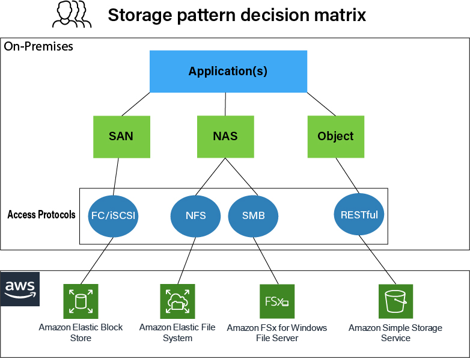

# 02. NFS, CIFS 개념

## 이 장에서 배울 것

이 장에서는 **네트워크를 통해 파일을 공유하는 방식**인 NFS와 CIFS를 살펴봅니다.

- **NFS (Network File System)**: Linux/Unix 환경에서 사용하는 네트워크 파일 공유 프로토콜
- **CIFS (Common Internet File System)**: Windows 환경에서 사용하는 네트워크 파일 공유 프로토콜

두 기술 모두 **중앙 집중식 스토리지**의 대표적인 예이며, 이후 배울 **HDFS 같은 분산 스토리지와 비교**하면서 왜 빅데이터 환경에서는 분산 저장이 필요한지 이해할 수 있습니다.

---

## NFS (Network File System)

- **역할**: 주로 **Linux/Unix 계열 시스템**에서 사용하는 네트워크 파일 시스템 프로토콜.
- **개발 배경**: Sun Microsystems가 개발했으며, Unix 환경에서 원격 디렉토리를 로컬처럼 사용하기 위해 설계됨.

### 동작 방식

1. 서버가 특정 디렉토리를 `/etc/exports`에 설정해 **export**
2. 클라이언트가 `mount` 명령으로 해당 경로를 **마운트**
3. 이후 로컬 파일 시스템처럼 사용

```bash
mount -t nfs server:/data /mnt/data
```

### 특징

- POSIX 기반 권한 체계 사용 (uid/gid 기반)
- 주로 **내부 네트워크 환경**에서 사용
- Stateless(상태 비저장) 설계 → 서버 재시작 시 비교적 복구 용이
- 버전: NFSv3, NFSv4 (v4는 보안·성능 개선)

### 장점

- Linux 환경과 높은 호환성
- 설정이 비교적 단순
- 대규모 클러스터 환경에서 자주 사용 (HPC, Kubernetes 등)

### 단점

- Windows와 기본 호환성 낮음
- 기본적으로 암호화 없음 (보안 취약 가능 → VPN 또는 내부망 권장)
- 네트워크 지연에 민감

### 사용 예

- 연구실/회사에서 공용 데이터 디렉토리
- Kubernetes Persistent Volume
- 머신러닝 학습용 공용 데이터 저장소

---

## CIFS / SMB (Common Internet File System / Server Message Block)

- **역할**: **Windows 기반 파일 공유의 표준 프로토콜**
- **개발 배경**:
  - Microsoft가 SMB(Server Message Block) 프로토콜을 확장하여 Windows 네트워크 공유에 사용
  - **CIFS는 SMB 2.0으로 대체**되었으며, 현재는 **SMB 3.1.1**이 최신 버전
  - 일부 레거시 시스템에서는 여전히 CIFS 명칭을 사용하지만, 최신 Windows 환경에서는 SMB 프로토콜이 표준
- **사용 사례**: Windows 공유 폴더, 회사 내부 파일 서버, NAS 접근

### 동작 방식

1. 서버가 공유 폴더 생성
2. 클라이언트가 네트워크 경로로 접근

**Windows:**

```
\\server\shared_folder
```

**Linux:**

```bash
mount -t cifs //server/shared /mnt/shared -o username=user
```

### 특징

- 사용자 계정 기반 인증 (username/password)
- Active Directory와 통합 가능
- SMBv3부터는 암호화 및 성능 개선
- Windows 환경에서 사실상 표준

### 장점

- Windows와 완벽한 호환
- 인증/권한 관리 체계가 강력함
- NAS 장비 대부분 기본 지원

### 단점

- Linux 환경에서는 설정이 다소 복잡
- 오버헤드가 NFS보다 큰 편
- 오래된 SMBv1은 보안 취약 (현재는 사용 금지 권장)

### 사용 예

- 사무실 공유 드라이브
- NAS(Network Attached Storage)
- Windows 도메인 환경 파일 서버

---

## NFS vs CIFS/SMB 비교

| 항목         | NFS                  | CIFS/SMB               |
| ------------ | -------------------- | ---------------------- |
| 주 사용 환경 | Linux/Unix           | Windows                |
| 인증 방식    | UID/GID 기반         | 사용자 계정 기반       |
| 성능         | 일반적으로 더 가벼움 | 상대적으로 오버헤드 큼 |
| 보안         | 기본 암호화 없음     | SMBv3 암호화 지원      |
| 활용 분야    | 서버/클러스터        | 사무실/NAS             |

**한 줄 정리**

- **NFS** → Linux 서버 간 파일 공유에 적합
- **SMB** → Windows 기반 네트워크 파일 공유에 적합 (CIFS는 과거 명칭, 현재는 SMB 3.1.1 등 최신 SMB가 표준)

### AWS 스토리지 패턴 선택 (Decision Matrix)

클라우드에서 파일 스토리지를 설계할 때, NFS와 SMB 중 어떤 프로토콜을 쓸지 결정하는 데 참고할 수 있는 패턴이 있습니다. AWS에서 제시하는 스토리지 패턴 결정 매트릭스는 사용 환경·요구사항에 따라 NFS vs SMB를 선택하는 기준을 정리한 것입니다.



- **NFS**: Linux/Unix 워크로드, HPC·ML 학습·공유 데이터 디렉터리 등에서 주로 권장.
- **SMB**: Windows 기반 애플리케이션, Active Directory 연동, 사무실 공유 드라이브·NAS 형태 서비스에 적합.
- 위 그림을 참고해 **접근 클라이언트(OS)·인증 방식·암호화 요구사항**에 맞는 프로토콜을 선택하면 됩니다.

---

## Docker / Podman에서 NFS·SMB 볼륨 마운트 (참고)

> 💡 **실습 아님 - 참고용**  
> NFS/SMB 서버 환경이 구성되지 않았기 때문에, 이 섹션은 **따로 실습하지 않습니다**.  
> "컨테이너에서 이렇게 네트워크 스토리지를 연결할 수 있다"는 점만 알아두시면 됩니다.

컨테이너는 보통 **호스트가 먼저 NFS/SMB를 마운트한 뒤**, 그 경로를 컨테이너에 연결하는 구조를 사용합니다. 컨테이너가 직접 NFS/SMB에 붙는 경우는 드뭅니다.

### 방법 1: 호스트에서 먼저 마운트 (가장 일반적)

**1단계 — 호스트에 NFS 마운트**

```bash
sudo mount -t nfs 192.168.0.10:/data /mnt/nfs
```

또는 SMB:

```bash
sudo mount -t cifs //192.168.0.20/shared /mnt/smb \
  -o username=user,password=pass
```

**2단계 — 컨테이너에 바인드 마운트**

```bash
docker run -v /mnt/nfs:/app/data ubuntu
# 또는 Podman
podman run -v /mnt/nfs:/app/data ubuntu
```

- 가장 단순하고, 디버깅이 쉬우며, 운영에서 가장 많이 쓰입니다.

### 방법 2: Docker volume driver로 직접 연결

Docker는 NFS를 volume으로 직접 붙일 수 있습니다.

```bash
docker volume create \
  --driver local \
  --opt type=nfs \
  --opt o=addr=192.168.0.10,rw \
  --opt device=:/data \
  my_nfs_volume
```

사용:

```bash
docker run -v my_nfs_volume:/app/data ubuntu
```

Podman도 비슷한 방식 지원 (rootful 모드에서 더 안정적).

### Docker Compose 예시 (참고만)

> ⚠️ **실제 환경 없이는 작동하지 않습니다**  
> 아래 예시는 NFS 서버(192.168.0.10)가 실제로 있어야 작동합니다. 개념 이해용으로만 보시면 됩니다.

```yaml
version: "3.8"

services:
  app:
    image: ubuntu
    volumes:
      - nfs_data:/app/data

volumes:
  nfs_data:
    driver: local
    driver_opts:
      type: nfs
      o: addr=192.168.0.10,rw
      device: ":/data"
```

### 주의할 점

- **권한 (특히 NFS)**: NFS는 UID/GID 기반이라, 컨테이너 내부 uid와 NFS 서버 uid가 다르면 permission denied가 발생할 수 있습니다. uid 맞추기 또는 NFSv4 + idmap 설정으로 해결합니다.
- **macOS + Podman**: Podman machine(Linux VM) 안에서 NFS/SMB가 동작하므로, **VM 내부에 마운트**해야 합니다.

---

## Kubernetes에서 NFS PersistentVolume (참고)

> 💡 **실습 아님 - 참고용**  
> Kubernetes 환경이 없으므로 실습하지 않습니다. "Kubernetes에서 NFS를 이렇게 사용할 수 있다"는 것만 알아두시면 됩니다.

Kubernetes에서는 스토리지를 다음처럼 추상화합니다.

```
Pod → PVC (PersistentVolumeClaim) → PV (PersistentVolume) → Storage (NFS, EBS, Ceph 등)
```

| 구성요소 | 역할                       |
| -------- | -------------------------- |
| PV       | 실제 스토리지 정의         |
| PVC      | 사용자가 요청하는 스토리지 |
| Pod      | PVC를 마운트해 사용        |

### NFS PV 예시

**PersistentVolume:**

```yaml
apiVersion: v1
kind: PersistentVolume
metadata:
  name: nfs-pv
spec:
  capacity:
    storage: 10Gi
  accessModes:
    - ReadWriteMany
  nfs:
    path: /data
    server: 192.168.0.10
  persistentVolumeReclaimPolicy: Retain
```

`ReadWriteMany` → 여러 Pod가 동시에 접근 가능. 이게 NFS의 큰 장점입니다.

**PersistentVolumeClaim:**

```yaml
apiVersion: v1
kind: PersistentVolumeClaim
metadata:
  name: nfs-pvc
spec:
  accessModes:
    - ReadWriteMany
  resources:
    requests:
      storage: 5Gi
```

**Pod에서 사용:**

```yaml
apiVersion: v1
kind: Pod
metadata:
  name: app
spec:
  containers:
    - name: app
      image: nginx
      volumeMounts:
        - mountPath: /usr/share/nginx/html
          name: nfs-storage
  volumes:
    - name: nfs-storage
      persistentVolumeClaim:
        claimName: nfs-pvc
```

### Kubernetes에서 NFS를 쓰는 이유

- **여러 Pod 동시 접근 (RWX)**: EBS 같은 블록 스토리지는 보통 RWO(ReadWriteOnce).
- **상태 공유에 유리**: ML 모델 파일, 업로드 파일, 로그 집계 등.

### 단점

- 네트워크 지연, SPOF(NFS 서버 다운 시 전체 영향), 성능 병목 가능. 대규모 환경에서는 Ceph, GlusterFS, Cloud Managed Storage 등을 더 많이 사용합니다.

---

## 일반 네트워크 스토리지의 한계

- **중앙 집중식**: 한 대(또는 소수)의 스토리지 서버에 모든 접근이 몰리면, 그 서버가 **단일 장애점(SPOF)** 이 됩니다. 장애 시 전체 접근 불가.
- **확장**: 디스크를 늘리려면 서버를 바꾸거나 스토리지를 추가해야 하고, **대용량·고가용성**에는 한계가 있습니다.
- **목적**: 이런 한계를 넘기 위해 **분산 파일 시스템**(여러 서버에 데이터를 나누어 저장)이 등장했습니다. HDFS(Hadoop Distributed File System)는 그 대표 예입니다.

---

## 핵심 개념 정리

- **로컬 vs 네트워크 파일 시스템**: 로컬은 한 기기 안, 네트워크는 원격 디스크를 마운트해 씀.
- **NFS**: Linux/Unix용. 개발 배경·동작·특징·장단점·사용 예를 이해하고, Docker/K8s에서의 활용을 알면 됨.
- **CIFS/SMB**: Windows 공유·NAS에서 주로 사용. CIFS는 SMB 2.0으로 대체되었고, 현재는 SMB 3.1.1이 표준. 인증·보안(SMBv3) 차이 구분.
- **Docker/Podman**: 호스트 마운트 후 bind mount가 일반적; NFS 권한(uid/gid) 주의.
- **Kubernetes**: PV → PVC → Pod 구조; NFS는 RWX 지원이 핵심 장점.
- **한계**: 중앙 집중식 스토리지는 SPOF·확장성 문제가 있어, 분산 파일 시스템(HDFS 등)으로 이어짐.

---

## 참고

- [03_HDFS_개념_구조.md](03_HDFS_개념_구조.md) — HDFS로 이어지는 배경.

---

## 그림 출처

- **img/AWS_nfs_smb.png**: AWS 스토리지 패턴 결정 매트릭스(Decision Matrix). 출처: [NFS와 CIFS의 차이점 - AWS](https://aws.amazon.com/ko/compare/the-difference-between-nfs-and-cifs/).
