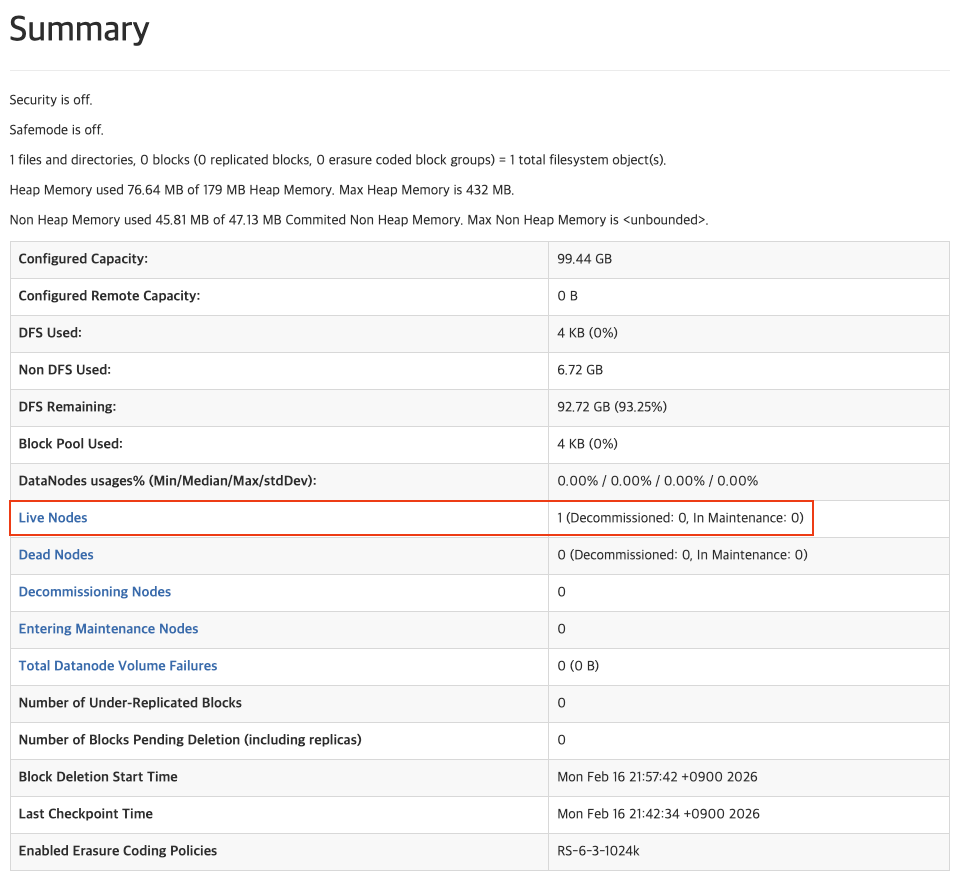

# 05. HDFS 환경 구성

## 실습 목표

Docker(Podman) Compose로 **HDFS 클러스터**(NameNode 1대, DataNode 1대)를 띄우고, Web UI로 확인합니다.

---

## 실습 단계

### 1. 공용 네트워크 생성

Day3에서 Spark와 연동하기 위해 공용 네트워크를 먼저 생성합니다.

```bash
# 공용 네트워크 생성
podman network create data-engineering-network
# 또는: docker network create data-engineering-network

# 네트워크 확인
podman network ls
# 또는: docker network ls
```

> 💡 **왜 네트워크를 만드나요?**
> - Day3에서 Spark가 HDFS 데이터를 읽으려면 같은 네트워크에 있어야 합니다.
> - 미리 공용 네트워크를 만들어두면 나중에 Spark를 추가하기만 하면 됩니다.

### 2. 작업 디렉토리 및 Compose 파일 준비

```bash
mkdir -p ~/Desktop/data-engineering/day2
cd ~/Desktop/data-engineering/day2
```

**docker-compose.yml** (같은 폴더에 생성):

```yaml
services:
  namenode:
    image: bde2020/hadoop-namenode:2.0.0-hadoop3.2.1-java8
    container_name: namenode
    ports:
      - "9870:9870"
      - "8020:8020"
    environment:
      - CLUSTER_NAME=test
      # bde2020 이미지: MULTIHOMED_NETWORK=1 이면 RPC/HTTP를 0.0.0.0에 바인딩 (다른 컨테이너에서 접속 가능)
      - MULTIHOMED_NETWORK=1
    volumes:
      - hadoop_namenode:/hadoop/dfs/name
    networks:
      - data-engineering-network

  datanode:
    image: bde2020/hadoop-datanode:2.0.0-hadoop3.2.1-java8
    container_name: datanode
    environment:
      # bde2020 NameNode RPC 포트는 8020 (9000 아님)
      - CORE_CONF_fs_defaultFS=hdfs://namenode:8020
    volumes:
      - hadoop_datanode:/hadoop/dfs/data
    networks:
      - data-engineering-network

volumes:
  hadoop_namenode:
  hadoop_datanode:

networks:
  data-engineering-network:
    external: true
```

> 💡 **networks 설정**: 
> - `networks: - data-engineering-network`: 각 컨테이너를 공용 네트워크에 연결
> - `external: true`: 외부에서 미리 생성한 네트워크 사용

### 3. HDFS 클러스터 시작

```bash
podman compose up -d
# 또는: docker compose up -d

podman ps
# 또는: docker ps
```

- NameNode, DataNode 컨테이너가 떠 있는지 확인합니다.

### 3. HDFS Web UI 접속

- 브라우저에서 **http://localhost:9870** 접속
- NameNode 정보, DataNode 상태(1개 Live) 확인

### 4. 트러블슈팅

- **포트 충돌**: 9870, 8020이 이미 쓰이면 `ports` 값을 바꿉니다 (예: `"9871:9870"`, `"8021:8020"`).
- **컨테이너 로그**: `podman compose logs` 또는 `podman logs namenode` 로 에러를 확인합니다.

#### DataNode가 NameNode에 연결되지 않을 때 (Retrying connect to server: namenode/...:8020)

DataNode 로그에 `Retrying connect to server: namenode/10.x.x.x:8020` 이 반복되면, **DataNode가 NameNode에 RPC로 접속하지 못하는** 상태입니다.  
**참고**: bde2020 이미지는 NameNode RPC 포트를 **8020**으로 씁니다. `fs_defaultFS`를 `hdfs://namenode:8020`으로 맞춰야 합니다.

**원인·대응:**

1. **NameNode가 아직 준비되지 않음**  
   NameNode는 기동 후 포맷·초기화에 30초~1분 걸릴 수 있습니다. DataNode가 먼저 기동되면 연결 실패 후 재시도합니다.
   - **대응**: 한 번 내렸다가 NameNode를 먼저 띄우고, 1분 정도 기다린 뒤 DataNode를 띄웁니다.
     ```bash
     podman compose down
     podman compose up -d namenode
     sleep 60
     podman compose up -d datanode
     ```
   - 또는 DataNode만 재시작: `podman compose restart datanode` (NameNode가 이미 정상일 때).

2. **NameNode가 8020에서 대기 중인지 확인**
   - NameNode 로그에 `RPC server is binding to 0.0.0.0:8020` 이 보이면 정상.
   - 호스트에서: `nc -zv localhost 8020`
     ```bash
     podman logs namenode 2>&1 | tail -30
     ```

3. **같은 Compose 네트워크인지 확인**  
   DataNode는 NameNode를 **서비스 이름 `namenode`** 로 찾습니다. 두 컨테이너가 같은 `docker compose` / `podman compose` 프로젝트로 띄워져 있어야 합니다.
   - DataNode 셸에서: `getent hosts namenode` 또는 `nc -zv namenode 8020` 로 접속 가능한지 확인.

4. **NameNode가 RPC를 localhost에만 바인딩**  
   NameNode RPC가 **127.0.0.1:8020**에만 바인딩되면 다른 컨테이너(DataNode)에서 접속이 안 됩니다.
   - **대응**: bde2020 이미지는 **`MULTIHOMED_NETWORK=1`** 환경 변수를 지원합니다. 이걸 설정하면 entrypoint가 자동으로 `dfs.namenode.rpc-bind-host`, `http-bind-host` 등을 **0.0.0.0**으로 넣습니다.
     ```yaml
     environment:
       - CLUSTER_NAME=test
       - MULTIHOMED_NETWORK=1
     ```
     적용 후:
     ```bash
     podman compose down
     podman compose up -d
     ```
     (그래도 안 되면 NameNode 로그에서 "Setting dfs.namenode.rpc-bind-host=0.0.0.0" 이 출력되는지 확인. 안 보이면 이미지 버전이 MULTIHOMED_NETWORK를 지원하지 않을 수 있음)

---

## 체크포인트

**"Web UI에서 DataNode가 1개 보이나요?"**

<details><summary> Live 확인 </summary>



</details>

---

## 핵심 개념 정리

- NameNode(메타데이터)·DataNode(블록 저장)를 Compose로 한 번에 기동.
- Web UI(9870)로 클러스터 상태 확인.

---

## 참고

- [06_HDFS_데이터_업로드.md](06_HDFS_데이터_업로드.md) — 다음 실습.

---

## 그림 출처

- **img/hdfs_live_node.png**: HDFS Web UI DataNode Live 확인 화면 (직접 캡처).
