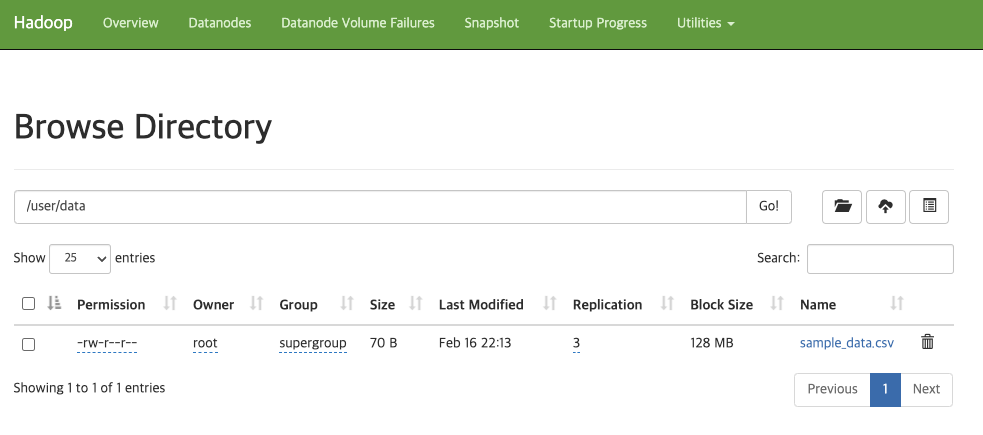

# 06. HDFS 데이터 업로드

## 실습 목표

HDFS에 **디렉토리를 만들고**, **로컬 파일을 업로드**합니다.

---

## 실습 단계

### 1. 샘플 데이터 준비 (로컬)

```bash
cd ~/Desktop/data-engineering/day2

cat > sample_data.csv << EOF
id,name,age,city
1,Alice,25,Seoul
2,Bob,30,Busan
3,Charlie,35,Incheon
EOF
```

### 2. HDFS 명령어 기본 (NameNode 컨테이너 안에서)

```bash
# NameNode 컨테이너 접속
podman exec -it namenode bash
# 또는: docker exec -it namenode bash

# HDFS 루트 목록
hdfs dfs -ls /

# 디렉토리 생성
hdfs dfs -mkdir /user
hdfs dfs -mkdir /user/data
```

### 3. 파일 업로드

로컬에서 컨테이너로 파일을 복사한 뒤, HDFS에 넣습니다.

```bash
# 로컬 → 컨테이너 (호스트 터미널에서)
podman cp sample_data.csv namenode:/tmp/
# 또는: docker cp sample_data.csv namenode:/tmp/

# 컨테이너 안에서 HDFS로 업로드
podman exec -it namenode bash
$ hdfs dfs -put /tmp/sample_data.csv /user/data/
2026-02-16 13:13:25,433 INFO sasl.SaslDataTransferClient: SASL encryption trust check: localHostTrusted = false, remoteHostTrusted = false

# 업로드 확인
$ hdfs dfs -ls /user/data/
Found 1 items
-rw-r--r--   3 root supergroup         70 2026-02-16 13:13 /user/data/sample_data.csv

```

### 4. Web UI에서 확인

- 브라우저 **http://localhost:9870** → "Browse the file system" 등에서 `/user/data/sample_data.csv` 위치·블록 정보 확인.

---

## 체크포인트

**"HDFS에 sample_data.csv가 보이나요?"**

<details><summary> 업로드 확인 </summary>

http://localhost:9870/explorer.html#/user/data



</details>

---

## 핵심 개념 정리

- `hdfs dfs -mkdir`, `-put`: 디렉토리 생성, 로컬 파일을 HDFS에 업로드.
- `podman cp` / `docker cp`: 호스트 파일을 컨테이너 안으로 복사한 뒤 `-put`으로 HDFS에 넣을 수 있음.

---

## 참고

- [HDFS FileSystem Shell](https://hadoop.apache.org/docs/stable/hadoop-project-dist/hadoop-common/FileSystemShell.html)
- [07_HDFS_데이터_조회_관리.md](07_HDFS_데이터_조회_관리.md) — 조회·관리 실습.

---

## 그림 출처

- **img/hdfs_upload_check.png**: HDFS Web UI Browse Directory 화면 (직접 캡처).
