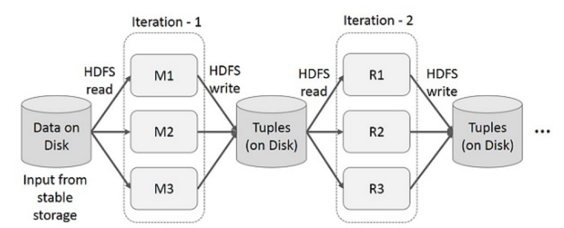
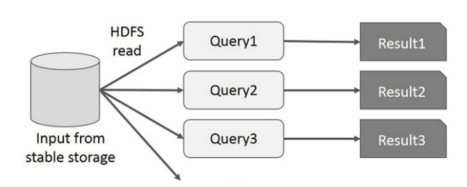
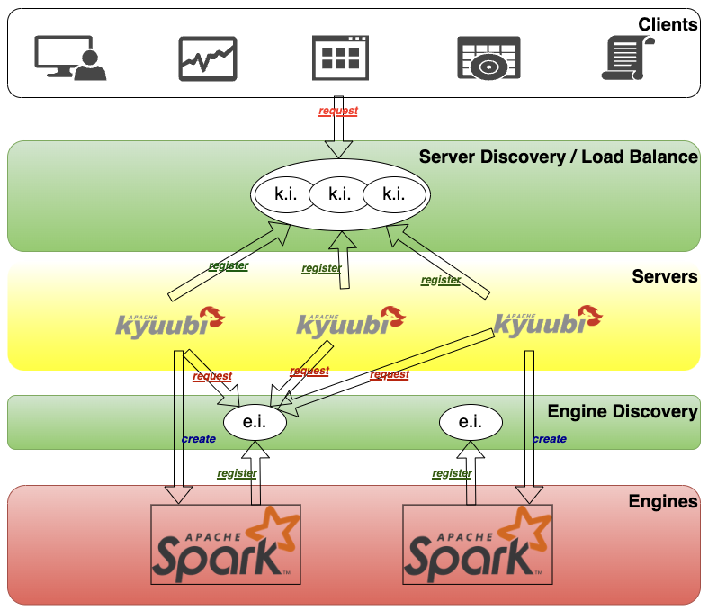

# 02. Apache Spark 개념

## 왜 우리가 Spark를 공부하는가?

### 요즘 사람들이 Spark를 많이 사용하는 이유

**1. 사실상의 표준 (De Facto Standard)**
- 빅데이터 처리 분야에서 **가장 널리 사용되는 프레임워크**
- 대부분의 기업이 Spark를 데이터 처리 엔진으로 채택
- 구인 공고에서 가장 많이 요구하는 기술 중 하나

**2. 통합 엔진 (Unified Engine)**
- **배치 처리**: 대용량 데이터 일괄 처리
- **스트림 처리**: 실시간 데이터 처리
- **머신러닝**: MLlib를 통한 대규모 ML 파이프라인
- **그래프 처리**: GraphX를 통한 그래프 분석
- 하나의 엔진으로 **모든 데이터 처리 워크로드** 커버

**3. 압도적인 성능**
- MapReduce 대비 **메모리 기반 처리에서 최대 100배 빠름**
- 디스크 기반 처리에서도 **10배 이상 빠른 성능**
- 반복 연산이 많은 ML/AI 작업에 최적화

**4. 다양한 언어 지원**
- **Python (PySpark)**: 데이터 분석가/사이언티스트에게 친숙
- **Scala**: Spark의 네이티브 언어, 최고 성능
- **Java**: 엔터프라이즈 환경에서 널리 사용
- **R**: 통계 분석가를 위한 지원
- **SQL**: 프로그래밍 없이 데이터 분석 가능

**5. 풍부한 생태계**
- 클라우드 플랫폼 완벽 지원 (AWS EMR, Azure HDInsight, GCP Dataproc)
- Kubernetes, YARN 등 다양한 클러스터 매니저 지원
- Delta Lake, Iceberg 등 데이터 레이크 포맷과 통합
- BI 도구 (Tableau, Power BI) 연동 용이

**6. 활발한 커뮤니티**
- Apache 최상위 프로젝트 (Top-Level Project)
- 지속적인 업데이트와 성능 개선
- 풍부한 문서와 학습 자료
- 대규모 사용자 커뮤니티와 기술 지원

**7. 실무 필수 기술**
- 데이터 엔지니어의 **핵심 역량**
- 데이터 사이언티스트도 대규모 데이터 처리를 위해 필수
- 클라우드 데이터 플랫폼의 중심 기술

### 정리

Spark는 단순히 "빠른 MapReduce"가 아닙니다. **현대 데이터 처리의 중심**이 되는 통합 플랫폼이며, 데이터 관련 직무를 목표로 한다면 **반드시 알아야 하는 기술**입니다.

---

## Apache Spark란?

- **정의**: 대규모 데이터 처리를 위한 **통합 분산 처리 엔진**.
- **핵심**: **In-memory** 처리로 MapReduce보다 빠름. 디스크 I/O를 줄여 반복 연산에 유리.

---

## MapReduce의 한계와 Spark의 등장

### MapReduce 한계

*그림: MapReduce는 각 Iteration(Stage) 사이마다 중간 데이터를 HDFS(On Disk)에 Write/Read*

MapReduce는 대량의 데이터를 처리할 수 있다는 점에서 큰 의미가 있지만, 실제로는 다음과 같은 한계가 있습니다:

- **디스크 기반 처리**: Map → 디스크 저장 → Reduce → 디스크 저장. 단계마다 디스크 I/O 발생.
- **과도한 Disk I/O**: 각 Iteration(Stage) 사이마다 생성되는 중간 데이터를 HDFS에 Write/Read 반복
  - 연산 시간보다 **Disk I/O에서 대부분의 시간 소요**
- **반복 처리 비효율**: 머신러닝처럼 반복 연산이 많은 작업에 매우 느림
- **복잡한 파이프라인**: 여러 MapReduce 잡을 연결해야 할 때 번거로움

*그림: Hive에서 실행 엔진을 MapReduce로 했을 경우의 처리 과정*

위 그림은 Hive에서 실행 엔진을 MapReduce로 했을 경우입니다. 각 쿼리는 HDFS(On Disk)에서 각각 읽어오고, 각 쿼리의 연산은 Map/Reduce의 중간 데이터를 Disk에 반복적으로 읽고 씁니다.

### Spark의 등장

Spark는 MapReduce의 이러한 한계를 극복하기 위해 탄생했습니다:

- UC Berkeley AMPLab에서 개발 (2009~), Apache 프로젝트로 편입
- **In-memory 처리**: 중간 결과를 **메모리에 유지** → 디스크 I/O 최소화
  - 연산 과정에서 중간 작업의 결과를 Disk가 아닌 **분산된 메모리에 저장**
  - RDD(Resilient Distributed Dataset)와 in-memory cache를 통해 성능 개선
- **DAG 기반 실행**: 작업을 DAG(Directed Acyclic Graph)로 최적화해 실행
- **빠른 응답**: 동시에 여러 쿼리가 들어와도 RDD 데이터가 메모리에 로드되어 있으면 빠르게 응답

**성능 차이**: Spark는 MapReduce 대비 **메모리 기반 처리에서 최대 100배**, **디스크 기반 처리에서도 10배** 빠른 성능을 보입니다.

---

## Spark의 특징

- **In-memory 처리**: 반복 연산·대화형 분석에 유리.
- **다양한 언어 지원**: Scala, Python(PySpark), Java, R.
- **통합 엔진**: Batch, Streaming, ML, Graph를 하나의 엔진에서.
- **유연한 배포**: Standalone, YARN, Mesos, Kubernetes.

---

## Spark vs Hadoop MapReduce

| 항목 | Hadoop MapReduce | Apache Spark |
|------|------------------|--------------|
| 처리 방식 | 디스크 기반 | 메모리 기반 |
| 속도 | 느림 (디스크 I/O) | 빠름 (In-memory) |
| 반복 연산 | 비효율적 | 효율적 |
| 언어 | Java 중심 | Scala, Python, Java, R |
| 사용 사례 | 대용량 배치 처리 | 배치 + 스트리밍 + ML |

---

## Spark 생태계

- **Spark Core**: 기본 분산 처리 엔진, RDD.
- **Spark SQL**: 구조화 데이터, DataFrame, SQL 쿼리.
- **Spark Streaming / Structured Streaming**: 실시간·준실시간 스트리밍.
- **MLlib**: 머신러닝 라이브러리.
- **GraphX**: 그래프 처리.

### Apache Kyuubi

*그림: Kyuubi 아키텍처 레이어 구조*

*그림: Kyuubi 전체 아키텍처*

**Apache Kyuubi**는 Spark SQL을 위한 **순수 SQL 게이트웨이**입니다.

#### 핵심 특징

- **Thrift JDBC/ODBC 인터페이스**: 최종 사용자가 JDBC/ODBC를 통해 Spark SQL에 접근
- **순수 SQL 게이트웨이**: 프로그래밍 없이 SQL만으로 대규모 데이터 조작 가능
- **사전 프로그래밍된 Spark SQL 엔진**: 미리 구성된 Spark SQL 엔진을 활용
- **확장 가능**: 커스터마이징 및 확장 가능한 구조

#### Kyuubi 아키텍처 레이어

Kyuubi는 여러 계층으로 구성되어 있습니다:

1. **클라이언트 레이어**: JDBC/ODBC 클라이언트가 Kyuubi 서버에 연결
2. **Kyuubi 서버 레이어**: 사용자 요청을 받아 Spark 엔진으로 라우팅
3. **Spark SQL 엔진 레이어**: 실제 쿼리를 실행하는 Spark 엔진
4. **데이터 소스 레이어**: HDFS, S3, Hive 등 다양한 데이터 소스

#### 왜 현업에서 Kyuubi가 필요한가?

**1. 고가용성 (High Availability, HA)**
- 단일 Spark Thrift Server는 장애 발생 시 전체 서비스 중단
- Kyuubi는 **여러 서버 인스턴스**를 운영하여 한 서버가 다운되어도 다른 서버로 자동 전환
- 24/7 운영이 필요한 프로덕션 환경에서 필수

**2. 로드 밸런싱 (Load Balancing, LB)**
- 수십~수백 명의 사용자가 동시에 쿼리를 실행하는 환경
- Kyuubi는 **여러 Spark 엔진**에 쿼리를 분산하여 부하 분산
- 단일 Spark Thrift Server는 리소스 부족으로 성능 저하 발생

**3. 멀티 테넌트 지원**
- 팀/부서별로 **독립된 Spark 엔진** 할당 가능
- 리소스 격리 및 보안 강화
- 한 팀의 무거운 쿼리가 다른 팀에 영향을 주지 않음

**4. 세션 관리 및 리소스 최적화**
- 유휴 세션 자동 종료로 리소스 절약
- 동적 리소스 할당 및 관리

**5. 엔터프라이즈 기능**
- 인증/권한 관리 (Kerberos, LDAP 등)
- 쿼리 로깅 및 모니터링
- 감사(Audit) 기능

#### 사용 사례

- **BI 도구 연동**: Tableau, Power BI 등 BI 도구에서 Spark에 직접 연결
- **SQL 기반 데이터 분석**: 데이터 분석가가 SQL만으로 대규모 데이터 분석
- **멀티 테넌트 환경**: 여러 사용자가 안전하게 Spark 리소스 공유
- **대규모 프로덕션 환경**: 수백 명의 동시 사용자를 지원하는 데이터 플랫폼

#### 💡 실습에서는 왜 Kyuubi를 다루지 않나요?

본 실습에서는 **Kyuubi를 다루지 않습니다**. 그 이유는:

- **HA/LB가 불필요**: 실습 환경은 소수의 사용자만 사용하므로 고가용성과 로드 밸런싱이 필요 없음
- **단순성 우선**: Spark의 핵심 개념을 학습하는 데 집중하기 위해 추가 레이어를 제외
- **리소스 제약**: 실습 환경에서 여러 Kyuubi 서버와 Spark 엔진을 운영하기 어려움

실무에서 **대규모 사용자를 지원**하거나 **24/7 안정적인 서비스**가 필요한 경우에는 Kyuubi 도입을 고려합니다.

#### Kyuubi의 발전 방향

Kyuubi는 처음에는 **Spark만 지원**하는 게이트웨이로 시작했지만, 현재는 **범용 게이트웨이**로 발전하고 있습니다:

- **클라이언트 측 확장**: 다양한 JDBC/ODBC 클라이언트 지원 강화
- **엔진 측 확장**: Spark뿐만 아니라 **Trino, Flink, Hive** 등 다양한 엔진 지원
- **Gateway Level**: 클라이언트와 엔진 양쪽을 모두 지원하는 통합 게이트웨이로 진화

즉, Kyuubi는 단순한 Spark 게이트웨이를 넘어 **다양한 데이터 처리 엔진을 위한 통합 SQL 게이트웨이**로 나아가고 있습니다.

참고: [Apache Kyuubi 공식 문서](https://kyuubi.readthedocs.io/en/master/)

---

## 실제 사용 사례

- **Netflix**: 추천 시스템, 데이터 파이프라인.
- **Uber**: 실시간 수요 예측, 가격 최적화.
- **Airbnb**: 검색 랭킹, 사기 탐지.

---

## 핵심 개념 정리

- Spark는 **In-memory 분산 처리 엔진**. MapReduce의 디스크 I/O 한계를 극복.
- 배치·스트리밍·ML·그래프를 **통합 엔진**에서 처리.
- Scala, Python 등 **다양한 언어**를 지원하며, 실무에서 널리 사용됨.

---

## 참고

- [03_Spark_아키텍처.md](03_Spark_아키텍처.md) — 다음 단계: Spark 아키텍처 학습.
- [Spark 공식 문서](https://spark.apache.org/docs/latest/)

---

## 그림 출처

| 그림 파일 | 설명 | 출처 |
|-----------|------|------|
| Apache_Spark_logo.svg.png | Apache Spark 로고 | [Apache Spark](https://spark.apache.org/) |
| map_reduce.png | MapReduce 처리 과정 (On Disk) | [Blue's IT Society](https://blue-it-society.tistory.com/2) |
| hive_mr.png | Hive on MapReduce 처리 과정 | [Blue's IT Society](https://blue-it-society.tistory.com/2) |
| kyuubi_layers.drawio.png | Apache Kyuubi 아키텍처 레이어 | [Apache Kyuubi 공식 문서](https://kyuubi.readthedocs.io/en/master/) |
| kyuubi_architecture.png | Apache Kyuubi 전체 아키텍처 | [Apache Kyuubi 공식 문서](https://kyuubi.readthedocs.io/en/master/) |
