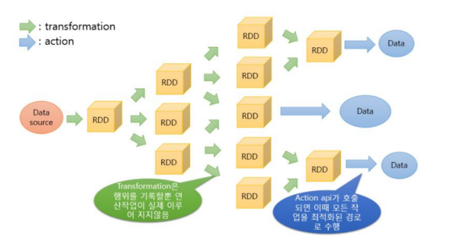

# 03. Spark 처리 흐름 및 아키텍처

## Spark 아키텍처


*그림: Spark 클러스터 아키텍처 개요*

Spark 클러스터는 **Driver**, **Cluster Manager**, **Executor**로 구성됩니다.

```
Driver Program
    ↓ (작업 요청)
Cluster Manager (YARN, Mesos, K8s, Standalone)
    ↓ (리소스 할당)
Executor (Worker 노드에서 실행)
    ↓ (Task 실행)
데이터 처리
```

### Driver Program

- 사용자가 작성한 **Spark 애플리케이션의 메인 프로세스**.
- SparkContext(또는 SparkSession)를 생성.
- 작업을 **Task 단위로 분할**하고, Executor에 배분.

### Cluster Manager

클러스터의 **리소스를 관리**하고, Executor를 할당합니다.

#### 주요 역할

1. **리소스 할당**
   - Driver가 실제 Task를 실행할 Executor(Worker 노드)의 가용한 자원을 요청
   - Cluster Manager(예: YARN)는 요청받은 리소스를 할당

2. **모니터링 및 관리**
   - Executor의 자원 사용, 성능, Job 종료 후 Driver에게 알림
   - Driver와 Executor 중간에서 상태 및 성능 정보 전달

3. **장애 복구**
   - 작업 도중 Worker 노드가 Task를 실패하면, 같은 Task를 다른 노드에 재할당하여 작업 이어감

#### 지원하는 Cluster Manager 종류

Spark는 현재 여러 클러스터 매니저를 지원합니다:

- **Standalone**: Spark에 포함된 간단한 클러스터 매니저로, 클러스터를 쉽게 설정할 수 있습니다.
- **Hadoop YARN**: Hadoop 3의 리소스 매니저입니다.
- **Kubernetes**: 컨테이너화된 애플리케이션의 배포, 스케일링, 관리를 자동화하는 오픈소스 시스템입니다.

### Executor

**Executor**는 애플리케이션을 위해 Worker 노드에서 실행되는 프로세스입니다. 실제로 데이터에 접근하고 할당된 Task를 수행하는 Worker입니다.

#### 주요 특징

- **Task 실행**: Driver로부터 받은 복수의 Task를 실행하고 결과를 Driver에게 전달합니다.
- **데이터 저장**: Task 간에 데이터를 **메모리 또는 디스크**에 유지합니다.
- **데이터 접근**: HDFS(Disk)에서 데이터를 읽어와 Task 단위로 실행합니다.
- **애플리케이션 독립성**: 각 애플리케이션은 **자체 Executor**를 가집니다.
  - 서로 다른 애플리케이션의 Executor는 격리되어 있습니다.
  - 한 애플리케이션이 다른 애플리케이션의 데이터에 접근할 수 없습니다.

#### 리소스 설정

Spark Job을 제출할 때 Executor의 리소스를 지정할 수 있습니다:

- **Executor 수**: 몇 개의 Executor를 사용할지 (`--num-executors`)
- **Core 수**: 각 Executor가 몇 개의 (virtual) core를 사용할지 (`--executor-cores`)
- **메모리**: 각 Executor가 얼마의 memory를 사용할지 (`--executor-memory`)

예시:
```bash
spark-submit \
  --num-executors 10 \
  --executor-cores 4 \
  --executor-memory 8G \
  my_app.py
```

---

## Spark 애플리케이션 동작 순서

Spark 애플리케이션이 실행되는 전체 흐름을 단계별로 살펴보겠습니다.

### 1. Driver가 리소스 요청

Spark Driver는 계획한 plan(Stage, Task)이 실행될 Executor를 Cluster Manager(예: YARN)에게 요청합니다.

### 2. Cluster Manager가 리소스 할당

Cluster Manager는 제출된 Task를 기준으로 Executor(요청된 memory, core가 할당된 container)를 할당합니다.

### 3. Executor가 Task 실행

각 Executor는 HDFS(Disk)에서 데이터를 읽어와 Task 단위로 실행합니다.

- Task는 하나의 **Partition**과 매핑되어 처리됩니다.
- 각 Partition 사이의 데이터 이동을 **Shuffle**이라고 합니다.

### 4. Cluster Manager의 모니터링

이 과정에서 Cluster Manager는 Driver와 Executor 중간에서 상태 및 성능 정보를 전달합니다.

### 5. 결과 반환 및 종료

각 Executor의 Task들이 마무리되면:
1. 해당 내용을 Driver에게 전달
2. Driver는 정보를 종합해 Client에게 제공
3. 애플리케이션 종료

### 전체 흐름 요약

```
1. Client → Driver: 애플리케이션 제출
2. Driver → Cluster Manager: Executor 리소스 요청
3. Cluster Manager → Worker Nodes: Executor 할당
4. Executor → HDFS: 데이터 읽기
5. Executor: Task 실행 (Partition 단위)
6. Executor → Driver: 결과 전달
7. Driver → Client: 최종 결과 반환
```

---

## RDD (Resilient Distributed Dataset)

### RDD란?

**RDD**는 Spark에서의 **기본 데이터 구조**입니다. 쉽게 말해 **데이터들의 집합**이라고 생각하면 됩니다.

- **논리적 구조**: RDD는 **Partition**이라는 논리적 분할 단위로 구성
- **물리적 구조**: 실제로는 **객체들의 집합**

### RDD의 의미

- **Resilient (복원력)**: 일부 노드가 실패해도 재계산으로 복구 가능
- **Distributed (분산)**: 여러 노드에 분산 저장
- **Dataset (데이터셋)**: 파티션 단위로 나뉜 데이터

### RDD의 특징

**1. Read-only (읽기 전용)**
- **Partition된 Record들의 집합**
- 한 번 만들면 수정 불가 (Immutable)
- 변환 시 새로운 RDD 생성

**2. 다양한 생성 방법**

RDD는 여러 방법으로 만들 수 있습니다:

- **외부 스토리지로부터**: HDFS, S3, 로컬 파일 시스템 등
  ```python
  rdd = sc.textFile("hdfs://path/to/file.txt")
  ```

- **다른 RDD의 연산 결과로부터**: Transformation 연산
  ```python
  rdd2 = rdd1.filter(lambda x: x > 10)
  ```

- **Driver의 Collection을 병렬화**: parallelize()
  ```python
  data = [1, 2, 3, 4, 5]
  rdd = sc.parallelize(data)  # 여러 노드에 병렬로 분산
  ```

**3. Lazy Evaluation (지연 실행)**
- Transformation은 즉시 실행되지 않고, Action이 호출될 때 실행
- 실행 계획만 기록하고 최적화

**4. Lineage (계보)**
- 변환 이력을 기록해 장애 시 재계산 가능
- 데이터 복제 없이도 장애 복구 가능

### RDD의 구조

```
RDD
├── Partition 1 (Worker Node 1)
│   └── [객체1, 객체2, 객체3, ...]
├── Partition 2 (Worker Node 2)
│   └── [객체4, 객체5, 객체6, ...]
└── Partition 3 (Worker Node 3)
    └── [객체7, 객체8, 객체9, ...]
```

각 Partition은 독립적으로 처리되며, 이것이 Spark의 병렬 처리를 가능하게 합니다.

---

## DataFrame과 Dataset

### Spark의 데이터 추상화 진화

Spark는 시간이 지나면서 데이터를 다루는 방식이 발전해왔습니다:

1. **RDD (초기)**: 저수준 API, 모든 것을 직접 제어
2. **DataFrame (Spark 1.3~)**: SQL 유사 API, 자동 최적화
3. **Dataset (Spark 1.6~)**: DataFrame + 타입 안전성

### 왜 이렇게 발전했을까?

**문제점**: RDD는 강력하지만 사용하기 어렵고, Spark가 최적화하기 어려웠습니다.

**해결책**: 
- **DataFrame**: SQL처럼 쉽게 사용할 수 있고, Catalyst 옵티마이저가 자동으로 최적화
- **Dataset**: DataFrame의 장점 + 컴파일 타임 타입 체크로 안전성 향상

### 비교표

| 구분 | RDD | DataFrame | Dataset |
|------|-----|-----------|---------|
| 타입 안전성 | 있음 | 없음 | 있음 (Scala/Java) |
| 최적화 | 없음 | Catalyst 최적화 | Catalyst 최적화 |
| API | 저수준 | SQL 유사 | SQL 유사 + 타입 |
| 사용 언어 | 모두 | 모두 | Scala, Java |
| 사용 난이도 | 어려움 | 쉬움 | 중간 |
| 성능 | 수동 최적화 필요 | 자동 최적화 | 자동 최적화 |

### 각각 언제 사용할까?

- **RDD**: 저수준 제어가 필요하거나, 비정형 데이터 처리 시
  - 예: 복잡한 커스텀 로직, 텍스트 파싱
- **DataFrame**: 구조화된 데이터, SQL 쿼리 스타일 작업 (가장 많이 사용)
  - 예: 데이터 분석, ETL 파이프라인, BI 도구 연동
- **Dataset**: 타입 안전성이 중요한 Scala/Java 프로젝트
  - 예: 엔터프라이즈 애플리케이션, 컴파일 타임 에러 검증 필요 시

### 실무 권장사항

- **PySpark 사용자**: DataFrame을 주로 사용하세요 (Dataset은 Python에서 지원 안 함)
- **Scala/Java 사용자**: DataFrame 또는 Dataset 사용 (타입 안전성이 필요하면 Dataset)
- **신규 프로젝트**: 특별한 이유가 없다면 DataFrame 사용을 권장합니다

---

## Lazy Evaluation

- **Transformation**은 즉시 실행되지 않고, **실행 계획만 기록**.
- **Action**이 호출될 때 비로소 **실제 계산 수행**.

### 왜 Lazy?

- 여러 Transformation을 **하나의 최적화된 실행 계획**으로 합칠 수 있음.
- 불필요한 중간 결과 저장을 피함.

---

## Transformation vs Action



*그림: Transformation과 Action의 실행 흐름 시각화*

### Transformation (변환)

- 새 RDD/DataFrame을 반환. **지연 실행**.
- 예: `map()`, `filter()`, `select()`, `groupBy()`, `join()`

### Action (액션)

- 결과를 반환하거나 저장. **즉시 실행**.
- 예: `count()`, `collect()`, `show()`, `write()`

```python
# Transformation (아직 실행 안 됨)
df2 = df.filter(df.age > 30)

# Action (여기서 실제 실행)
df2.show()
```

---

## 핵심 개념 정리

- **Driver**: 작업을 분할하고 Executor에 배분. **Executor**: 실제 데이터 처리.
- **RDD**: 불변·분산·복구 가능한 기본 데이터 구조. **DataFrame**: 컬럼 기반, 최적화.
- **Lazy Evaluation**: Transformation은 기록만, Action 시 실행. 최적화에 유리.
- **Transformation vs Action**: filter/map은 지연, count/show는 즉시 실행.

---

## 참고

- [04_PySpark_기본문법.md](04_PySpark_기본문법.md) — 다음 단계: PySpark 기본 문법.
- [Spark Cluster Mode Overview](https://spark.apache.org/docs/latest/cluster-overview.html)

---

## 그림 출처

| 그림 파일 | 설명 | 출처 |
|-----------|------|------|
| cluster-overview.png | Spark 클러스터 아키텍처 개요 | [Apache Spark 공식 문서](https://spark.apache.org/docs/latest/cluster-overview.html) |
| spark_transformation_action.png | Transformation과 Action 실행 흐름 | [Blue's IT Society](https://blue-it-society.tistory.com/3) |
