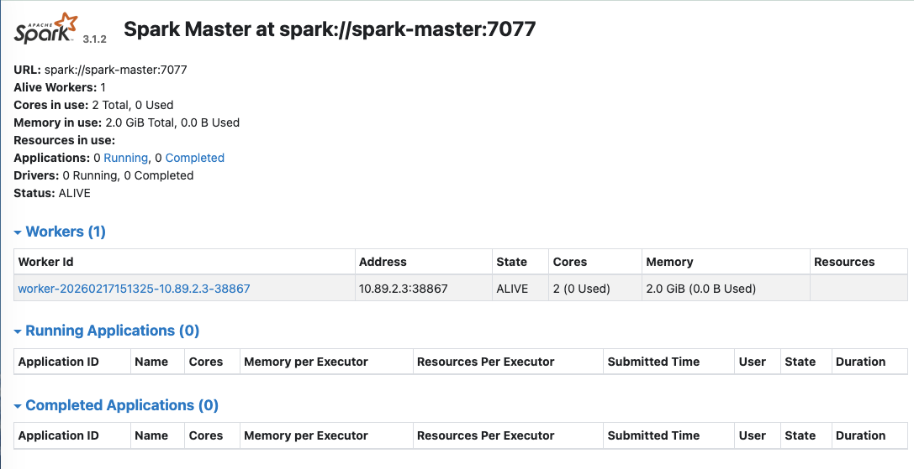

# 05. PySpark 환경 설정

## 실습 목표

Docker(Podman) Compose로 **Spark 클러스터**(Master 1대, Worker 1대)를 띄우고, Web UI로 확인합니다.

### Spark 이미지 선택: bde2020/spark

**Hadoop 3.2와 호환되는 Spark 이미지**

Day2에서 구성한 **Hadoop 3.2 환경과 호환**되는 Spark 이미지를 사용합니다.

- **Hadoop 3.2 호환**: `bde2020/spark-master:3.1.2-hadoop3.2`
- **통합 환경**: Day2 HDFS 환경과 완벽 호환
- **검증된 조합**: Hadoop + Spark 통합 환경으로 검증됨
- **무료**: 완전 무료로 사용 가능

> 💡 **중요**: Spark와 Hadoop은 버전 호환성이 매우 중요합니다. Day2에서 구성한 Hadoop 3.2와 호환되는 Spark 3.1.2-hadoop3.2 이미지를 사용해야 HDFS 연동이 정상적으로 작동합니다.

---

## 실습 단계

### 1. 작업 디렉토리 및 Compose 파일 준비

```bash
mkdir -p ~/Desktop/data-engineering/day3/data
cd ~/Desktop/data-engineering/day3
```

**docker-compose.yml** (같은 폴더에 생성):

```yaml
services:
  spark-master:
    image: bde2020/spark-master:3.1.2-hadoop3.2
    container_name: spark-master
    hostname: spark-master
    ports:
      - "8080:8080"
      - "7077:7077"
    volumes:
      - ./data:/home/jovyan/work/data
    environment:
      - INIT_DAEMON_STEP=setup_spark
      - SPARK_MASTER_HOST=spark-master
      - SPARK_MASTER_PORT=7077
    networks:
      - data-engineering-network

  spark-worker:
    image: bde2020/spark-worker:3.1.2-hadoop3.2
    container_name: spark-worker
    hostname: spark-worker
    depends_on:
      - spark-master
    ports:
      - "8081:8081"
    volumes:
      - ./data:/home/jovyan/work/data
    environment:
      - SPARK_MASTER=spark://spark-master:7077
      - SPARK_WORKER_CORES=2
      - SPARK_WORKER_MEMORY=2g
      - INIT_DAEMON_STEP=setup_spark
      - SPARK_PUBLIC_DNS=localhost
    networks:
      - data-engineering-network

  pyspark-notebook:
    image: jupyter/pyspark-notebook:spark-3.1.2
    container_name: pyspark-notebook
    ports:
      - "8888:8888"
    volumes:
      - ./data:/home/jovyan/work/data
    environment:
      - JUPYTER_ENABLE_LAB=yes
      - SPARK_MASTER=spark://spark-master:7077
    depends_on:
      - spark-master
    networks:
      - data-engineering-network

volumes: {}

networks:
  data-engineering-network:
    external: true
```

> 💡 **참고**: 
> - `pyspark-notebook` 컨테이너는 Jupyter Notebook 환경에서 PySpark를 사용할 수 있게 해줍니다.
> - 실습에서는 `pyspark-notebook`을 사용하는 것을 권장합니다.
> - **중요**: 모든 컨테이너가 동일한 `/home/jovyan/work/data` 경로를 사용하여 데이터를 공유합니다.
> - Jupyter Lab에서는 `work/data` 폴더에서 데이터 파일을 확인할 수 있습니다.
> - 노트북 파일은 컨테이너 내부에 저장되므로, 필요시 Jupyter Lab에서 다운로드하여 백업하세요.
> - **Day2에서 생성한 `data-engineering-network`에 연결**되어 HDFS와 통신 가능합니다.
> - `SPARK_PUBLIC_DNS=localhost`: Worker Web UI 링크가 `localhost`로 표시되도록 설정 (내부 IP 대신)

### 2. Spark 클러스터 시작

```bash
podman compose up -d
# 또는: docker compose up -d

podman ps
# 또는: docker ps
```

- `spark-master`, `spark-worker` 컨테이너가 떠 있는지 확인합니다.

### 3. Spark Web UI 접속

**Spark Master UI:**
- 브라우저에서 **http://localhost:8080** 접속
- Master 상태, Worker 1개 연결 확인

**Jupyter Notebook (PySpark):**

**첫 접속 시 토큰 필요:**

1. 아래 명령어로 토큰이 포함된 URL 확인:
```bash
podman logs pyspark-notebook 2>&1 | grep "127.0.0.1:8888"
```

2. 출력 예시:
```
http://127.0.0.1:8888/lab?token=2d825dcbbe303ae6101297202d7918164beb0fadd2d34d2f
```

3. **전체 URL을 복사하여 브라우저에 붙여넣기** (가장 쉬운 방법)
   - 한 번 접속하면 **브라우저에 세션이 저장**됩니다
   - 이후에는 **http://localhost:8888** 로 바로 접속 가능 (토큰 입력 불필요)

4. 또는 `token=` 뒤의 문자열만 복사하여 로그인 페이지에 입력

> 💡 **Tip**: 토큰이 포함된 URL을 한 번만 사용하면 됩니다. 브라우저 쿠키에 세션이 저장되어 다음부터는 토큰 없이 접속할 수 있습니다.

### 4. 트러블슈팅

**포트 충돌**
- 8080, 7077, 8888이 이미 사용 중이면 `ports` 값을 변경합니다.

**컨테이너 로그 확인**
```bash
podman logs spark-master
podman logs spark-worker
podman logs pyspark-notebook
```

**Worker 연결 안 됨**
- Master가 완전히 뜬 뒤 Worker가 시작되도록 `depends_on` 확인
- 필요하면 Worker만 재시작: `podman compose restart spark-worker`

**Jupyter Notebook 토큰 찾기**
```bash
# 토큰이 포함된 전체 URL 확인
podman logs pyspark-notebook 2>&1 | grep "127.0.0.1:8888"

# 또는 토큰만 추출
podman logs pyspark-notebook 2>&1 | grep -oP 'token=\K[a-f0-9]+'
```

**Jupyter Notebook 접속 안 됨**
- 컨테이너가 정상 실행 중인지 확인: `podman ps | grep pyspark`
- 로그에서 에러 확인: `podman logs pyspark-notebook`

**Spark Web UI에서 Worker 로그 링크가 안 열림**
- 문제: Executor Summary 페이지에서 stdout/stderr 링크가 `10.89.x.x:8081`로 표시되어 접근 불가
- 원인: Worker가 내부 IP를 Master에게 알려줌
- 해결: `SPARK_PUBLIC_DNS=localhost` 환경 변수 설정 (위 docker-compose.yml에 이미 포함)
- 또는 수동으로 URL을 `localhost:8081`로 변경하여 접속

---

## 체크포인트

**체크리스트:**

1. ✅ **Spark Web UI(http://localhost:8080) 에서 Worker가 1개 보이나요?**

<details><summary> Live 확인 </summary>



</details>

2. ✅ **Jupyter Notebook(http://localhost:8888) 에 접속할 수 있나요?**
   - 토큰을 입력하여 로그인 성공
   - 새 노트북을 생성할 수 있음

3. ✅ **컨테이너 3개가 모두 실행 중인가요?**
   ```bash
   podman ps
   # spark-master, spark-worker, pyspark-notebook 확인
   ```

---

## 핵심 개념 정리

- Spark Master(클러스터 관리)·Worker(실제 처리)를 Compose로 한 번에 기동.
- Web UI(8080)로 클러스터 상태 확인.

---

## 참고

- [06_데이터_로드_기본조작.md](06_데이터_로드_기본조작.md) — 다음 단계: 데이터 로드 및 기본 조작.

---

## 그림 출처

| 그림 파일 | 설명 | 출처 |
|-----------|------|------|
| spark_ui.png | Spark Web UI - Worker 확인 화면 | 실습 스크린샷 |
