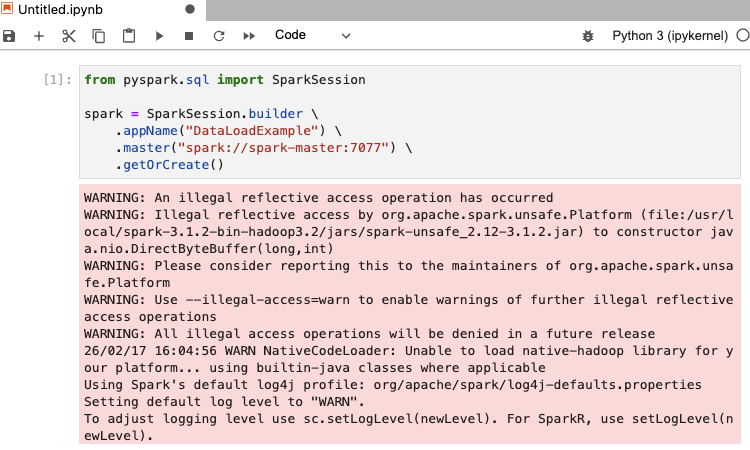
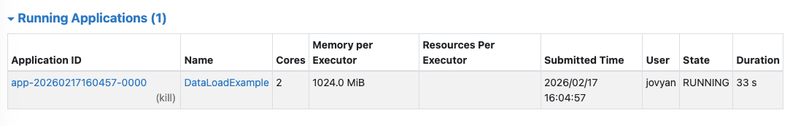
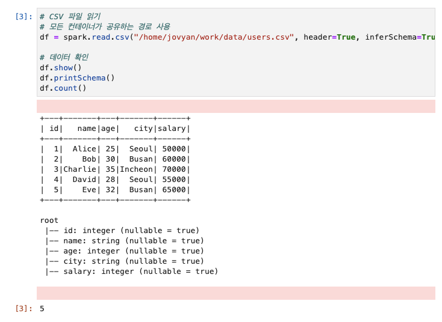

# 06. 데이터 로드 및 기본 조작

## 실습 목표

PySpark로 CSV 데이터를 읽고, 기본 조회·선택·통계를 수행합니다.

---

## 실습 단계

### 1. 샘플 데이터 준비

```bash
cat > ~/Desktop/data-engineering/day3/data/users.csv << 'EOF'
id,name,age,city,salary
1,Alice,25,Seoul,50000
2,Bob,30,Busan,60000
3,Charlie,35,Incheon,70000
4,David,28,Seoul,55000
5,Eve,32,Busan,65000
EOF
```

### 2. PySpark 환경 접속

**방법 1: Jupyter Notebook 사용 (권장)**

1. 브라우저에서 **http://localhost:8888** 접속
2. 새 노트북 생성 (Python 3)
3. 아래 코드로 SparkSession 생성:

> 💡 **Jupyter Notebook 사용 팁**: 
> - 코드 셀에 코드를 입력한 후 `Shift + Enter`를 누르면 실행됩니다.
> - 또는 상단의 ▶️ (Run) 버튼을 클릭해도 됩니다.

```python
from pyspark.sql import SparkSession

spark = SparkSession.builder \
    .appName("DataLoadExample") \
    .master("spark://spark-master:7077") \
    .getOrCreate()
```




**방법 2: PySpark 셸 사용**

```bash
podman exec -it pyspark-notebook bash
pyspark --master spark://spark-master:7077
```

- `pyspark` 셸에 들어가면 `spark` 변수(SparkSession)가 이미 생성되어 있습니다.

> 💡 **권장**: Jupyter Notebook을 사용하면 코드와 결과를 함께 저장하고 시각화할 수 있어 학습에 더 효과적입니다.

### 3. 데이터 로드

```python
# SparkSession 확인
spark

# CSV 파일 읽기
# 모든 컨테이너가 공유하는 경로 사용
df = spark.read.csv("/home/jovyan/work/data/users.csv", header=True, inferSchema=True)

# 데이터 확인
df.show()
df.printSchema()
df.count()
```

> 💡 **경로 주의**: 
> - 컨테이너 내부: `/home/jovyan/work/data/users.csv` (모든 Spark 컨테이너 공통)
> - Jupyter Lab 파일 브라우저: `work/data/users.csv`
> - 로컬 호스트: `~/Desktop/data-engineering/day3/data/users.csv`



### 4. 기본 조작

```python
# 컬럼 선택
df.select("name", "age").show()

# 통계 정보
df.describe().show()

# 특정 컬럼만 통계
df.describe("age", "salary").show()
```

---

## 체크포인트

**"데이터가 5개 행으로 보이나요?"**

---

## 핵심 개념 정리

- `spark.read.csv()`: CSV 파일 로드. `header=True`, `inferSchema=True` 옵션.
- `show()`, `printSchema()`, `count()`: 데이터 확인 기본 메서드.
- `select()`: 원하는 컬럼만 선택.
- `describe()`: 기술 통계(count, mean, stddev, min, max).

---

## 참고

- [07_필터링_집계.md](07_필터링_집계.md) — 다음 단계: 필터링 및 집계.

---

## 그림 출처

| 파일명 | 출처 |
|--------|------|
| spark_session_create.png | 직접 캡처 |
| spark_running_applications.png | 직접 캡처 |
| spark_read_users.png | 직접 캡처 |
