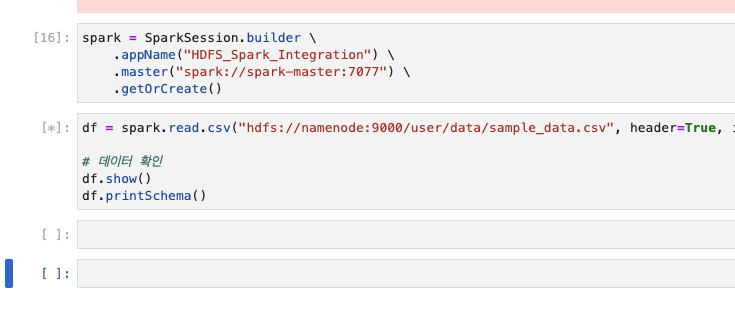
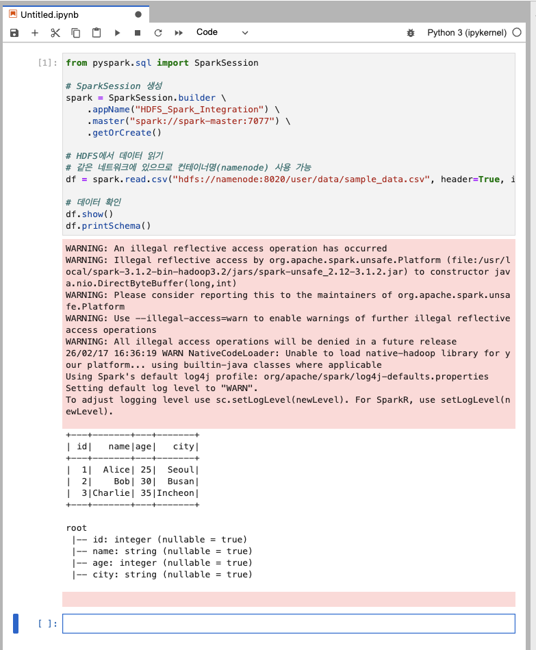
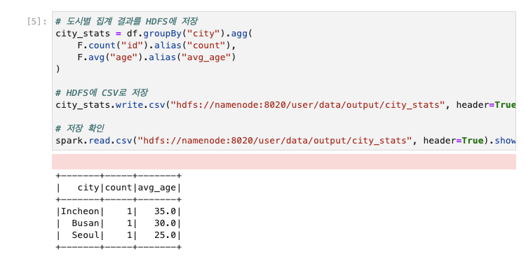
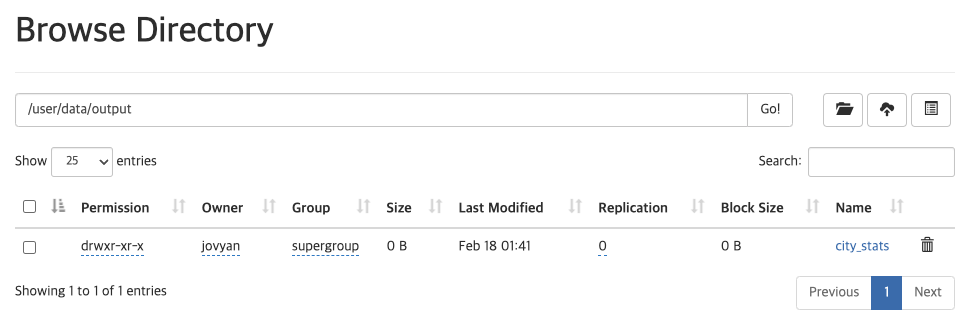

# 08. HDFS와 Spark 연동

## 실습 목표

Day2에서 HDFS에 업로드한 데이터를 **Spark로 읽어서 분석**합니다.

---

## 사전 준비

### 1. 네트워크 확인

Day2에서 `data-engineering-network`를 생성했으므로, Day3 Spark 컨테이너도 자동으로 같은 네트워크에 연결됩니다.

```bash
# 네트워크 확인
podman network ls | grep data-engineering
# 또는: docker network ls | grep data-engineering

# 네트워크에 연결된 컨테이너 확인
podman network inspect data-engineering-network
# 또는: docker network inspect data-engineering-network
```

예상 출력: `namenode`, `datanode`, `spark-master`, `spark-worker`, `pyspark-notebook`이 모두 보여야 합니다.

> 💡 **네트워크가 없다면?**
> - Day2 실습을 다시 확인하세요. [05_HDFS_환경구성.md](../Day2/05_HDFS_환경구성.md)에서 네트워크를 생성했어야 합니다.
> - 네트워크가 없으면 다음 명령어로 생성:
>   ```bash
>   podman network create data-engineering-network
>   # Day2, Day3 컨테이너 재시작 필요
>   ```

### 2. HDFS 상태 및 권한 설정

```bash
# HDFS 컨테이너 상태 확인
podman ps | grep namenode
podman ps | grep datanode

# HDFS에 데이터가 있는지 확인
podman exec -it namenode hdfs dfs -ls /user/data/

# Spark(jovyan 사용자)가 쓸 수 있도록 권한 변경
podman exec -it namenode hdfs dfs -chmod -R 777 /user/data
# 또는: docker exec -it namenode hdfs dfs -chmod -R 777 /user/data
```

예상 출력:
```
Found 1 items
-rw-r--r--   3 root supergroup         70 2026-02-16 13:13 /user/data/sample_data.csv
```

> ⚠️ **중요**: 
> - bde2020 HDFS 이미지는 RPC 포트로 **8020**을 사용합니다 (9000 아님).
> - **권한 설정 필수**: Spark는 `jovyan` 사용자로 실행되므로 HDFS 디렉토리에 쓰기 권한이 필요합니다.
> - 실무에서는 사용자별 디렉토리를 만들지만, 실습에서는 간단히 `777` 권한 사용

---

## 실습 단계

### 0. 기존 Spark 애플리케이션 종료 (선택사항)

로컬 환경에서는 리소스가 제한적이므로, 기존 애플리케이션을 종료하고 새로 시작하는 것을 권장합니다.

1. 브라우저에서 **http://localhost:8080** (Spark Master Web UI) 접속
2. **Running Applications** 섹션에서 실행 중인 애플리케이션 확인
3. 애플리케이션 이름 클릭 → 상단의 **Kill** 버튼 클릭
4. **Completed Applications**로 이동 확인



> 💡 **왜 Kill 해야 하나요?**
> - 실무에서는 클러스터 리소스가 충분하여 여러 애플리케이션을 동시에 실행 가능
> - 로컬 환경(노트북/PC)에서는 메모리와 CPU가 제한적이므로 기존 애플리케이션을 종료하는 것이 좋음
> - 특히 Day2 HDFS와 Day3 Spark를 동시에 실행하면 리소스 부족 가능

### 1. Spark에서 HDFS 데이터 읽기

신규 Jupyter Notebook에서 다음 코드를 실행합니다.

```python
from pyspark.sql import SparkSession

# SparkSession 생성
spark = SparkSession.builder \
    .appName("HDFS_Spark_Integration") \
    .master("spark://spark-master:7077") \
    .getOrCreate()

# HDFS에서 데이터 읽기
# 같은 네트워크에 있으므로 컨테이너명(namenode) 사용 가능
df = spark.read.csv("hdfs://namenode:8020/user/data/sample_data.csv", header=True, inferSchema=True)

# 데이터 확인
df.show()
df.printSchema()
```

> 💡 **HDFS URI 형식**: 
> - `hdfs://namenode:8020/경로` 형식으로 HDFS 파일에 접근합니다.
> - `namenode`는 같은 네트워크(`data-engineering-network`)에 있는 NameNode 컨테이너명
> - bde2020 이미지는 RPC 포트로 **8020**을 사용합니다 (Hadoop 3.x)



### 2. 데이터 분석

```python
from pyspark.sql import functions as F

# 도시별 인원 수
df.groupBy("city").count().show()

# 평균 나이
df.agg(F.avg("age").alias("avg_age")).show()

# 나이가 30 이상인 사람
df.filter(df.age >= 30).show()
```

### 3. 결과를 HDFS에 저장

```python
# 도시별 집계 결과를 HDFS에 저장
city_stats = df.groupBy("city").agg(
    F.count("id").alias("count"),
    F.avg("age").alias("avg_age")
)

# HDFS에 CSV로 저장
city_stats.write.csv("hdfs://namenode:8020/user/data/output/city_stats", header=True, mode="overwrite")

# 저장 확인
spark.read.csv("hdfs://namenode:8020/user/data/output/city_stats", header=True).show()
```



### 4. HDFS Web UI에서 확인

브라우저에서 **http://localhost:9870** 접속 후:
- "Browse the file system" 클릭
- `/user/data/output/city_stats` 디렉토리 확인
- 생성된 파일들 확인 (part-00000-*.csv 형태)



### 5. 트러블슈팅

**문제: "No live nodes contain block" 또는 "Failed to connect to DataNode"**

원인: Spark와 HDFS가 서로 다른 네트워크에 있어 DataNode에 직접 연결 불가

해결: **반드시 공용 네트워크 설정 필요** (위의 "1. 네트워크 문제 해결" 참조)

**문제: "Call to localhost:8020 failed - Connection refused"**

원인: 컨테이너 내부에서 `localhost`는 자기 자신을 가리킴

해결: `namenode:8020` 사용 (같은 네트워크에 있을 때)

**문제: "Port 9000: Connection refused"**

원인: bde2020 이미지는 포트 8020을 사용함 (Hadoop 3.x)

해결: URI를 `hdfs://namenode:8020/...`로 변경

**문제: "Permission denied: user=jovyan, access=WRITE"**

원인: Spark는 `jovyan` 사용자로 실행되는데, HDFS 디렉토리가 `root` 소유

해결:
```bash
# HDFS 디렉토리 권한 변경
podman exec -it namenode hdfs dfs -chmod -R 777 /user/data

# 또는 jovyan 사용자 디렉토리 생성
podman exec -it namenode hdfs dfs -mkdir -p /user/jovyan
podman exec -it namenode hdfs dfs -chown jovyan:jovyan /user/jovyan
```

**문제: 네트워크 설정 후에도 연결 안 됨**

확인 사항:
```bash
# 네트워크 확인
podman network ls
# data-engineering-network가 있는지 확인

# 컨테이너가 네트워크에 연결되었는지 확인
podman network inspect data-engineering-network
# namenode, datanode, spark-master, spark-worker, pyspark-notebook이 모두 있어야 함
```

---

## 체크포인트

**"HDFS의 데이터를 Spark로 읽고, 결과를 다시 HDFS에 저장했나요?"**

다음 명령어로 확인:
```bash
podman exec -it namenode hdfs dfs -ls /user/data/output/city_stats
```

<details>
<summary>예상 결과</summary>

```
Found 2 items
-rw-r--r--   3 root supergroup          0 2026-02-17 ... /user/data/output/city_stats/_SUCCESS
-rw-r--r--   3 root supergroup         XX 2026-02-17 ... /user/data/output/city_stats/part-00000-....csv
```

</details>

---

## 핵심 개념 정리

- **HDFS URI**: `hdfs://namenode:8020/경로` 형식으로 HDFS 파일 접근 (bde2020 이미지는 포트 8020 사용)
- **컨테이너 네트워킹**: 
  - **NameNode 접근**: 메타데이터 조회 (파일 위치 정보)
  - **DataNode 접근**: 실제 데이터 읽기/쓰기 (반드시 같은 네트워크 필요)
  - 서로 다른 docker-compose의 컨테이너는 **공용 네트워크**로 연결 필수
- **Spark ↔ HDFS 연동**: Spark는 HDFS를 네이티브로 지원하여 대용량 데이터 처리 가능
- **분산 저장**: Spark의 write 결과는 여러 part 파일로 분산 저장됨
- **실무 활용**: HDFS에 원본 데이터를 저장하고, Spark로 처리한 결과를 다시 HDFS에 저장하는 패턴

---

## 참고

- [09_Spark_SQL.md](09_Spark_SQL.md) — 다음 단계: Spark SQL 실습.
- [Spark with HDFS](https://spark.apache.org/docs/latest/hadoop-provided.html)

---

## 그림 출처

| 파일명 | 출처 |
|--------|------|
| spark_completed_applications.png | Spark Master Web UI 캡처 (직접 캡처) |
| spark_read_hdfs.png | Jupyter Notebook 실행 결과 (직접 캡처) |
| spark_hdfs_save.png | Jupyter Notebook 실행 결과 (직접 캡처) |
| hdfs_output.png | HDFS Web UI 캡처 (직접 캡처) |
