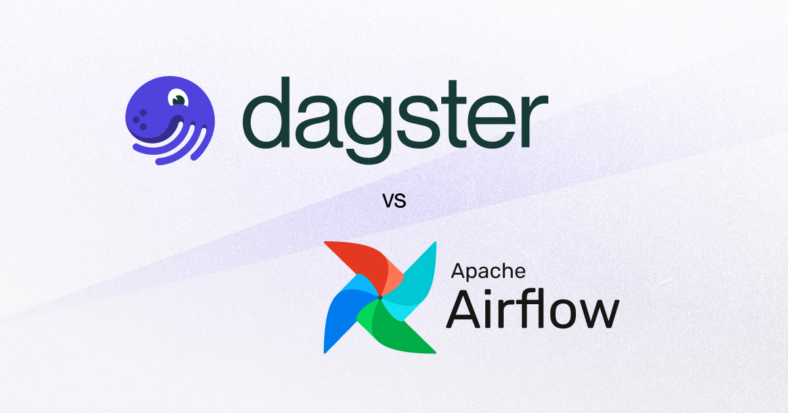

# 02. 배치 처리 개념

## 배치 처리란?

- **정의**: 일정 기간 동안 쌓인 데이터를 **한 번에 모아서 처리**하는 방식.
- **예**: 매일 자정에 하루치 로그를 집계해 리포트 생성, 월말에 한 달 매출 집계.

---

## 실시간 처리 vs 배치 처리

| 항목        | 실시간 처리 (Streaming)           | 배치 처리 (Batch)              |
| ----------- | --------------------------------- | ------------------------------ |
| 처리 시점   | 데이터 도착 즉시                  | 일정 주기마다                  |
| 지연 시간   | 밀리초~초 단위                    | 분~시간 단위                   |
| 데이터 크기 | 작은 단위 (이벤트)                | 큰 단위 (파일, 테이블)         |
| 사용 사례   | 실시간 추천, 이상 탐지            | 일일 리포트, 데이터 웨어하우스 |
| 기술        | Kafka, Flink, **Spark Streaming** | Hadoop, **Spark Batch**        |

---

## 배치 처리가 필요한 경우

- **대용량 데이터 처리**: 하루치 로그 수백 GB를 한 번에 집계.
- **정기적인 리포트 생성**: 매일 아침 전날 매출 리포트.
- **데이터 웨어하우스 업데이트**: 야간에 OLTP → OLAP 데이터 동기화.
- **복잡한 변환**: 여러 소스를 조인·집계·정제하는 작업.

---

## 배치 작업 스케줄링

### Cron

- Linux 기본 스케줄러. 간단한 주기 작업에 적합.
- 예: 매일 오전 2시에 스크립트 실행.

```bash
0 2 * * * /path/to/script.sh
```

### Apache Airflow

- Python 기반 워크플로우 관리 도구.
- DAG(Directed Acyclic Graph)로 작업 의존성 정의.
- 웹 UI로 모니터링·재실행·로그 확인.
- **특징**: 성숙한 생태계, 방대한 커뮤니티, 수많은 사전 구축 통합(Operator).

### Dagster

- 현대적인 **데이터 자산(Asset) 중심** 오케스트레이터.
- **데이터 품질·테스트·관찰성**에 중점.
- 로컬 개발·단위 테스트·디버깅 지원.
- 내장 데이터 카탈로그로 **데이터 계보(Lineage)** 추적.
- 클라우드 네이티브·컨테이너 네이티브 설계.

---

## Airflow vs Dagster 비교



| 항목            | Apache Airflow                                 | Dagster                                                   |
| --------------- | ---------------------------------------------- | --------------------------------------------------------- |
| **접근 방식**   | **작업(Task) 중심** — 무엇을 실행할지 정의     | **데이터 자산(Asset) 중심** — 어떤 데이터를 생성할지 정의 |
| **개발·테스트** | 프로덕션 외 테스트 어려움                      | 로컬 개발·단위 테스트·디버깅 용이                         |
| **가시성·계보** | 작업 흐름 중심                                 | 데이터 의존성·계보·메타데이터 가시성 우수 (내장 카탈로그) |
| **인프라**      | 전통적 배포                                    | 클라우드·컨테이너 네이티브, 의존성 격리 우수              |
| **생태계**      | 방대한 커뮤니티, 사전 구축 통합 많음           | 신생, 커뮤니티 성장 중                                    |
| **적합한 경우** | 복잡한 워크플로우, 성숙한 팀, 다양한 통합 필요 | 새 데이터 플랫폼, 데이터 품질·테스트 중시, ML 워크로드    |

### 언제 어떤 것을 선택할까?

**Airflow를 선택**:

- 방대한 사전 구축 통합(Operator)이 필요할 때.
- Airflow 경험이 있는 성숙한 팀.
- 데이터 외 복잡한 워크플로우(비데이터 작업 포함) 관리.

**Dagster를 선택**:

- 새로운 데이터 플랫폼 구축.
- 데이터 품질·테스트·계보 추적이 중요할 때.
- 머신러닝 워크로드가 많을 때.
- 로컬 개발·디버깅 경험을 중시할 때.

---

## 핵심 개념 정리

- **배치 처리**: 일정 주기마다 쌓인 데이터를 한 번에 처리. 대용량·정기 리포트에 적합.
- **실시간 vs 배치**: 지연 시간·데이터 크기·사용 사례가 다름.
- **스케줄링**: Cron(간단), Airflow(작업 중심·성숙한 생태계), Dagster(데이터 자산 중심·품질·테스트).

---

## 참고

- [03_파이프라인_설계.md](03_파이프라인_설계.md) — 다음 단계: 파이프라인 설계.
- [Apache Airflow 공식 문서](https://airflow.apache.org/)
- [Dagster 공식 문서](https://docs.dagster.io/)

---

## 그림 출처

- **img/airflow_vs_dagster.jpeg**: Airflow vs Dagster 비교. 출처: [Dagster vs. Airflow - Dagster Blog](https://dagster.io/blog/dagster-airflow).
