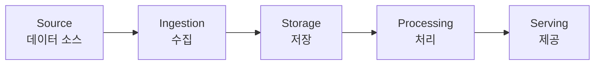
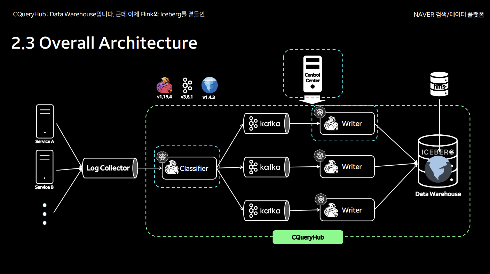

# 03. 데이터 파이프라인 설계

## 데이터 파이프라인이란?

- **정의**: 데이터가 **소스 → 목적지**로 흐르는 **일련의 처리 단계**.
- **목적**: 원시 데이터를 수집·변환·저장해 분석·서비스에 활용.

---

## 파이프라인의 구성 요소

### 1. Source (데이터 소스)

- 데이터가 생성되는 곳.
- 예: 웹 서버 로그, DB, API, IoT 센서.

### 2. Ingestion (수집)

- 데이터를 소스에서 가져오는 단계.
- 기술: **Kafka**, Flume, Logstash, Sqoop.

### 3. Storage (저장)

- 원시 데이터를 저장.
- 기술: **HDFS**, S3, Data Lake.

### 4. Processing (처리)

- 데이터를 변환·집계·정제.
- 기술: **Spark**, **Hive**, **Flink**.

### 5. Serving (제공)

- 처리된 데이터를 서비스·분석에 제공.
- 기술: **Data Warehouse** (Redshift, BigQuery), BI 도구 (Tableau, Looker).

**참고**: 위 구성 요소 중 **굵게 표시된 기술**(Kafka, HDFS, Spark, Hive, Flink, Data Warehouse)은 현재 실무에서 제공하고 있는 플랫폼입니다.

### 네이버 검색 파이프라인 사례

네이버 검색은 위와 같은 전체 아키텍처로 데이터 파이프라인을 구성하고 있습니다. 자세한 내용은 [DAN 2024 - 네이버 검색 데이터 파이프라인 영상](https://dan.naver.com/24/sessions/609)을 참고하세요.

**주목할 점**:

- **Processing(처리)** 단계에서 **플랫폼**으로 제공: 사용자가 **취사선택**할 수 있도록 다양한 처리 엔진을 제공합니다.
  - Python 코드 → **Spark**
  - SQL 쿼리 → **Hive**
  - 실시간 스트리밍 → **Flink**
- 데이터 엔지니어는 **처리 로직만 작성**하고, 워크로드 특성에 맞는 엔진을 선택하면 됩니다.
- 이런 **추상화된 플랫폼**이 있으면 사용자는 인프라를 신경 쓰지 않고 데이터 처리에만 집중할 수 있습니다.
- **이번 강의에서는 편의상 Spark를 사용**하지만, 실무에서는 요구사항에 따라 Hive, Flink 등을 선택할 수 있습니다.

---

## 파이프라인 설계 원칙

### 멱등성 (Idempotency)

- **같은 입력**으로 **여러 번 실행**해도 **같은 결과**.
- 재실행 시 중복 데이터가 생기지 않도록.

### 재실행 가능성

- 실패 시 **특정 단계부터 재실행** 가능하도록 설계.
- 체크포인트·로그 활용.

### 모니터링과 로깅

- 각 단계의 **성공/실패·처리 시간·데이터 건수** 기록.
- 알림·대시보드로 실시간 모니터링.

---

## 데이터 품질 관리

- **스키마 검증**: 예상한 컬럼·타입인지 확인.
- **중복 제거**: 같은 데이터가 여러 번 들어오지 않도록.
- **결측치 처리**: Null 값을 채우거나 제거.
- **이상치 탐지**: 비정상 값(음수 나이, 미래 날짜 등) 필터링.

---

## 실제 기업의 파이프라인 사례

- **Netflix**: 수십 PB 데이터를 S3 → Spark → Redshift로 처리.
- **Uber**: Kafka로 실시간 수집 → Spark Streaming → Hive/Presto.
- **Airbnb**: Airflow로 수천 개 배치 작업 스케줄링.

---

## 핵심 개념 정리

- **파이프라인**: Source → Ingestion → Storage → Processing → Serving.
- **설계 원칙**: 멱등성, 재실행 가능성, 모니터링.
- **데이터 품질**: 스키마 검증, 중복 제거, 결측치·이상치 처리.

---

## 참고

- [04_Data_Warehouse_Data_Lake.md](04_Data_Warehouse_Data_Lake.md) — 다음 단계: Data Warehouse와 Data Lake 개념.

---

## 그림 출처

- **img/naver_overall_architecture.png**: 네이버 검색 데이터 파이프라인 전체 아키텍처. 출처: [DAN 2024 - 네이버 검색 데이터 파이프라인](https://dan.naver.com/24/sessions/609).
