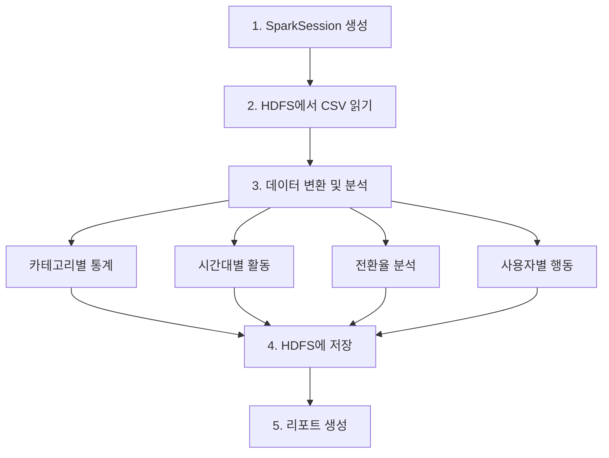

# 03. 종합 실습: 전자상거래 로그 분석 파이프라인

## 실습 목표

5일간 배운 모든 내용을 활용하여 **전자상거래 로그 분석 파이프라인**을 직접 구축합니다.

> 💡 **이번 실습은 여러분이 직접 해보는 시간입니다!**
> - 정답 코드는 제공하지 않습니다.
> - **힌트는 최대한 보지 말고**, 2번 이상 생각해도 정말 모르겠을 때만 확인하세요.
> - 5일간 배운 내용을 모두 활용하세요 (Linux, HDFS, Spark, ETL).
> - 정말 막히면 강사에게 질문하세요!

---

## 실습 시나리오

고객 행동 로그를 수집하여 분석하고, **일일 리포트를 생성하는 파이프라인**을 구축합니다.

### 파이프라인 구성

```
[원본 데이터] → [HDFS 업로드] → [Spark ETL] → [결과 저장] → [리포트 생성]
```

---

## 과제

### 과제 1: 환경 준비

**요구사항**:
1. Day5 작업 디렉토리 생성 (`~/Desktop/data-engineering/day5`)
2. HDFS 환경 확인 (namenode, datanode 실행 중)
3. Spark 환경 확인 (spark-master, pyspark-notebook 실행 중)

**작성할 명령어**:
```bash
# 1. 작업 디렉토리 생성 명령어를 작성하세요


# 2. 컨테이너 상태 확인 명령어를 작성하세요


```

<details>
<summary>힌트</summary>

```bash
mkdir -p ~/Desktop/data-engineering/day5
cd ~/Desktop/data-engineering/day5

# 컨테이너 상태 확인
podman ps
# 또는
docker ps
```

**체크포인트**:
- [ ] HDFS 환경 실행 중
- [ ] Spark 환경 실행 중

</details>

---

### HDFS 디렉토리 권한 설정

실습을 시작하기 전에 HDFS에서 Spark가 데이터를 읽고 쓸 수 있도록 권한을 설정합니다.

```bash
# HDFS 디렉토리 생성 및 권한 설정
podman exec -it namenode hdfs dfs -mkdir -p /user/data/raw /user/data/processed
podman exec -it namenode hdfs dfs -chmod -R 777 /user/data

# 또는 Docker 사용자
docker exec -it namenode hdfs dfs -mkdir -p /user/data/raw /user/data/processed
docker exec -it namenode hdfs dfs -chmod -R 777 /user/data
```

> 💡 **왜 필요한가요?**  
> Spark는 `jovyan` 사용자로 실행되는데, HDFS 디렉토리는 기본적으로 `root` 소유입니다. Day3에서 배운 것처럼 `chmod 777`로 모든 사용자가 읽고 쓸 수 있게 설정해야 합니다.

---

### 과제 2: 원본 데이터 생성 및 HDFS 업로드

**요구사항**:
1. 다음 샘플 데이터를 생성하세요.
2. HDFS의 `/user/data/raw/ecommerce/2026/02/14/` 경로에 업로드하세요.

**파일명**: `ecommerce_logs.csv`

```csv
timestamp,user_id,session_id,event_type,product_id,category,price,quantity
2026-02-14 09:00:15,101,s1001,view,p001,electronics,299.99,1
2026-02-14 09:01:30,101,s1001,add_to_cart,p001,electronics,299.99,1
2026-02-14 09:05:45,102,s1002,view,p002,clothing,49.99,1
2026-02-14 09:10:20,101,s1001,purchase,p001,electronics,299.99,1
2026-02-14 09:15:30,103,s1003,view,p003,books,19.99,1
2026-02-14 09:20:10,102,s1002,add_to_cart,p002,clothing,49.99,2
2026-02-14 09:25:45,104,s1004,view,p001,electronics,299.99,1
2026-02-14 09:30:20,102,s1002,purchase,p002,clothing,49.99,2
2026-02-14 09:35:15,105,s1005,view,p004,home,89.99,1
2026-02-14 09:40:30,103,s1003,add_to_cart,p003,books,19.99,3
2026-02-14 09:45:10,103,s1003,purchase,p003,books,19.99,3
2026-02-14 09:50:25,106,s1006,view,p005,electronics,499.99,1
2026-02-14 09:55:40,104,s1004,add_to_cart,p001,electronics,299.99,1
2026-02-14 10:00:15,107,s1007,view,p006,clothing,79.99,1
2026-02-14 10:05:30,105,s1005,add_to_cart,p004,home,89.99,1
```

**데이터 설명**:
- `timestamp`: 이벤트 발생 시각
- `user_id`: 고객 ID
- `session_id`: 세션 ID
- `event_type`: 이벤트 유형 (view, add_to_cart, purchase)
- `product_id`: 제품 ID
- `category`: 제품 카테고리
- `price`: 단가
- `quantity`: 수량

**작성할 명령어**:
```bash
# 1. 파일 생성 명령어를 작성하세요 (cat 사용)


# 2. HDFS 디렉토리 생성 명령어를 작성하세요


# 3. 파일을 namenode 컨테이너로 복사하는 명령어를 작성하세요


# 4. HDFS에 파일을 업로드하는 명령어를 작성하세요


# 5. 업로드 확인 명령어를 작성하세요


```

<details>
<summary>힌트 1: 파일 생성</summary>

```bash
cat > ~/Desktop/data-engineering/day5/ecommerce_logs.csv << 'EOF'
# ... 데이터 ...
EOF
```

</details>

<details>
<summary>힌트 2: HDFS 업로드</summary>

Day2에서 배운 HDFS 명령어를 활용하세요:
- `hdfs dfs -mkdir -p`: 디렉토리 생성
- `podman cp` 또는 `docker cp`: 컨테이너로 파일 복사
- `hdfs dfs -put`: HDFS에 파일 업로드
- `hdfs dfs -ls`: 업로드 확인

</details>

**체크포인트**:
- [ ] `ecommerce_logs.csv` 파일 생성 완료
- [ ] HDFS에 파일 업로드 완료
- [ ] `hdfs dfs -ls -R /user/data/raw/ecommerce/` 명령어로 파일 확인 가능

---

### 과제 3: ETL 파이프라인 구현

**목적**: 지금까지 배운 내용을 종합해서, **실무에서 하는 것처럼 E-commerce 로그를 분석하는 전체 파이프라인**을 만들어 봅니다.

이 과제를 완성하면 **"HDFS에 데이터를 넣고 → Spark로 처리하고 → 결과를 저장한다"는 실무 흐름**을 경험할 수 있습니다.

---

**정확히 뭘 해야 하나요?**

Jupyter Notebook에서 **Python 코드**로 다음을 구현합니다:

1. **입력 데이터 읽기**
   - HDFS 경로: `hdfs://namenode:8020/user/data/raw/ecommerce/2026/02/14/ecommerce_logs.csv`
   - PySpark로 CSV 파일을 DataFrame으로 읽기

2. **4가지 분석 수행**
   - **카테고리별 통계**: 각 제품 카테고리별로 이벤트 수, 고유 사용자 수, 총 매출, 구매 건수 계산
   - **시간대별 활동**: 시간대(hour)별로 이벤트 수와 활성 사용자 수 계산
   - **전환율 분석**: view → add_to_cart → purchase 각 단계별 건수 계산
   - **사용자별 행동**: 각 사용자의 총 이벤트 수, 세션 수, 총 지출액 계산

3. **분석 결과를 HDFS에 저장**
   - 4가지 분석 결과를 각각 별도 디렉토리에 Parquet 형식으로 저장
   - 저장 경로: `hdfs://namenode:8020/user/data/processed/ecommerce/2026/02/14/`
     - `category_stats/` - 카테고리별 통계
     - `hourly_activity/` - 시간대별 활동
     - `funnel/` - 전환율 분석
     - `user_behavior/` - 사용자별 행동

4. **저장된 결과를 다시 읽어서 리포트 출력**
   - HDFS에서 저장된 Parquet 파일들을 다시 읽기
   - 각 분석 결과의 샘플 데이터 출력

**배운 내용 활용**:
- Day2: HDFS 경로 구조
- Day3: PySpark DataFrame, CSV 읽기, groupBy/agg, Parquet 저장
- Day4: 함수 구조 설계, 예외 처리

**어떻게 접근할까?**

1. Day3-4에서 배운 PySpark 코드 참고
2. ETL 구조 (Extract → Transform → Load)로 함수 나누기
3. 막히면 ChatGPT/Cursor에게 물어보거나, 아래 힌트 참고

<details>
<summary>힌트 1: 전체 구조</summary>

**파이프라인 흐름:**



ETL 파이프라인은 보통 이런 함수들로 나눕니다:
- SparkSession을 생성하는 함수
- HDFS에서 CSV를 읽는 함수
- DataFrame을 가공하는 함수 (groupBy, agg 등)
- 결과를 HDFS에 parquet로 저장하는 함수
- 저장된 결과를 읽어서 출력하는 함수

</details>

<details>
<summary>힌트 2: 막히면 어디서 찾아볼까?</summary>

**참고 자료:**

1. **Day3-4 강의 자료 다시 보기**
   - Day3: [08_HDFS_Spark_연동.md](../Day3/08_HDFS_Spark_연동.md), [09_Spark_SQL.md](../Day3/09_Spark_SQL.md)
   - Day4: 실습 예제 코드
   - 이전에 작성했던 코드를 참고하세요

2. **PySpark 공식 문서 읽기**
   - [PySpark DataFrame API](https://spark.apache.org/docs/latest/api/python/reference/pyspark.sql/dataframe.html)
   - [PySpark Functions](https://spark.apache.org/docs/latest/api/python/reference/pyspark.sql/functions.html)
   - 필요한 함수를 검색해서 사용 예시를 보세요

3. **Google 검색**
   - "PySpark groupBy example"
   - "PySpark timestamp parsing"
   - 공식 문서, Stack Overflow, 블로그 등에서 예제 확인

스스로 문서를 읽고 이해하는 능력이 실무에서 중요합니다.

</details>

<details>
<summary>힌트 3: 로깅 추가</summary>

```python
import logging

logging.basicConfig(level=logging.INFO)
logger = logging.getLogger(__name__)

logger.info("📥 Extracting data...")
logger.info(f"✅ Loaded {df.count()} records")
```

</details>

<details>
<summary>힌트 4: 에러 처리</summary>

```python
try:
    # 파이프라인 실행
    ...
except Exception as e:
    logger.error(f"❌ Pipeline failed: {e}")
    import traceback
    traceback.print_exc()
    raise
```

</details>

**체크포인트**:
- [ ] SparkSession 생성 완료
- [ ] 데이터 읽기 완료 (15개 레코드)
- [ ] 변환 완료 (4개 결과: category_stats, hourly_activity, funnel, user_behavior)
- [ ] HDFS에 저장 완료 (Parquet 형식)

---

### 과제 4: 파이프라인 실행 및 리포트 생성

**요구사항**:
1. 작성한 파이프라인을 실행하세요.
2. 리포트를 생성하여 출력하세요.

**실행 방법**:

Jupyter Notebook에서 작성한 코드를 실행하세요.

```python
# 파이프라인 실행
main()
```

**예상 리포트 형식**:

```
============================================================
E-COMMERCE DAILY REPORT - 2026-02-14
============================================================

[1] Category Performance
+------------+------------+------------+-------------+---------+
|    category|total_events|unique_users|total_revenue|purchases|
+------------+------------+------------+-------------+---------+
| electronics|           5|           3|       299.99|        1|
|    clothing|           3|           2|        99.98|        1|
|       books|           3|           1|        59.97|        1|
|        home|           2|           1|         0.00|        0|
+------------+------------+------------+-------------+---------+

[2] Hourly Activity
+----+------+------------+
|hour|events|active_users|
+----+------+------------+
|   9|    13|           7|
|  10|     2|           2|
+----+------+------------+

[3] Event Funnel
+------------+-----+
|  event_type|count|
+------------+-----+
|        view|    8|
| add_to_cart|    5|
|    purchase|    3|
+------------+-----+

[4] Top 5 Users by Revenue
+-------+------------+--------+-----------+--------------------+
|user_id|total_events|sessions|total_spent|  categories_viewed|
+-------+------------+--------+-----------+--------------------+
|    101|           3|       1|     299.99|       [electronics]|
|    102|           3|       1|      99.98|          [clothing]|
|    103|           3|       1|      59.97|             [books]|
|    105|           2|       1|       0.00|              [home]|
|    104|           2|       1|       0.00|       [electronics]|
+-------+------------+--------+-----------+--------------------+
```

<details>
<summary>힌트: 리포트 생성 구조</summary>

```python
def generate_report(spark, output_base_path):
    """리포트 생성"""
    # 1. HDFS에서 저장된 각 분석 결과를 읽어옴
    #    - category_stats
    #    - hourly_activity
    #    - funnel
    #    - user_behavior
    
    # 2. 리포트 헤더 출력
    #    예: "E-COMMERCE DAILY REPORT - 2026-02-14"
    
    # 3. 각 분석 결과를 보기 좋게 출력
    #    - [1] Category Performance
    #    - [2] Hourly Activity
    #    - [3] Event Funnel
    #    - [4] Top 5 Users by Revenue
```

Day3에서 배운 `spark.read.parquet()`, `df.show()` 등을 활용하세요.

</details>

**체크포인트**:
- [ ] 파이프라인 실행 완료 (에러 없음)
- [ ] 리포트 출력 확인 (4개 테이블)

---

### 과제 5: 결과 검증

**요구사항**:
1. HDFS에서 결과 파일 확인
2. Jupyter Notebook에서 결과 데이터 읽어서 확인

**작성할 명령어/코드**:

```bash
# 1. HDFS에서 결과 파일 확인 명령어를 작성하세요


```

```python
# 2. Jupyter Notebook에서 결과 데이터 읽기 코드를 작성하세요
# 카테고리별 통계 확인


# 사용자별 행동 확인


```

<details>
<summary>힌트 1: HDFS 확인</summary>

Day2에서 배운 HDFS 목록 보여주는 명령어를 사용해서 다음 경로를 확인하세요:
- `/user/data/processed/ecommerce/`

4개의 디렉토리(category_stats, hourly_activity, funnel, user_behavior)가 생성되었는지 확인하세요.

</details>

<details>
<summary>힌트 2: Jupyter Notebook에서 확인</summary>

Day3에서 배운 Parquet 파일 읽는 명령어와 DataFrame 보여주는 명령어를 사용하세요.

저장 경로는:
- 작성한 Python 코드의 `load_data()` 함수에서 확인하거나
- HDFS browser(http://localhost:9870/explorer.html)에서 `/user/data/processed/` 경로 탐색

</details>

**체크포인트**:
- [ ] HDFS에 결과 저장 확인 (4개 디렉토리)
- [ ] Jupyter Notebook에서 결과 읽기 가능

---

## 전체 체크포인트

**"파이프라인이 성공적으로 실행되고 리포트가 생성되었나요?"**

- [ ] 환경 준비 완료 (HDFS, Spark 실행 중)
- [ ] 원본 데이터 HDFS에 업로드 완료
- [ ] ETL 파이프라인 구현 완료
- [ ] 파이프라인 실행 완료 (에러 없음)
- [ ] 리포트 출력 확인 (4개 테이블)
- [ ] HDFS에 결과 저장 확인 (4개 디렉토리)

---

## 핵심 개념 정리

### Day 1~4 통합 요소

| Day | 적용 내용 |
|-----|-----------|
| Day 1 | Python 스크립트, 로깅, 에러 처리 |
| Day 2 | HDFS 읽기/쓰기, 분산 저장 |
| Day 3 | PySpark DataFrame, Transformation/Action |
| Day 4 | ETL 파이프라인, 함수화, 검증 |

### 파이프라인 구성 요소

1. **Extract**: HDFS에서 원본 데이터 읽기
2. **Transform**: 데이터 변환 및 분석
   - 타임스탬프 파싱
   - 매출 계산
   - 집계 (카테고리별, 시간대별, 사용자별)
3. **Load**: 결과를 HDFS에 저장 (Parquet)
4. **Report**: 일일 리포트 생성

---

## 추가 도전 과제 (선택)

시간이 남으면 다음을 시도해보세요:

1. **데이터 품질 검증 추가**
   - Null 값 체크
   - 중복 체크
   - 비즈니스 로직 검증 (음수 매출 체크 등)

2. **성능 최적화**
   - 캐싱 (`cache()`) 사용
   - 파티셔닝 (`partitionBy()`) 사용

3. **추가 분석**
   - 제품별 전환율 (view → add_to_cart → purchase)
   - 시간대별 매출
   - 세션당 평균 이벤트 수

4. **ETL 파이프라인 컨테이너화** (Dockerfile + docker-compose)

   과제 3에서 Jupyter Notebook으로 작성한 ETL 파이프라인을 **컨테이너화**하여, 한 번의 명령으로 실행할 수 있게 만들어 보세요.

   **목표**: 실무에서처럼 Dockerfile과 docker-compose로 ETL 파이프라인을 패키징하고, 재현 가능한 환경으로 실행하기

   **요구사항**:

   1. **ETL 스크립트 분리**: Jupyter Notebook의 파이프라인 코드를 `etl_pipeline.py` Python 스크립트로 분리
   2. **Dockerfile 작성**: PySpark가 포함된 이미지를 빌드하는 Dockerfile 작성
   3. **docker-compose.yml 작성**: ETL 서비스를 정의하고, 기존 HDFS/Spark와 같은 네트워크(`data-engineering-network`)에 연결
   4. **실행**: `podman compose up`(또는 `docker compose up`)으로 ETL 파이프라인 실행

   **전제 조건**:
   - Day2 HDFS(namenode, datanode)와 Day3 Spark(spark-master, pyspark-notebook)가 이미 실행 중이어야 함
   - `data-engineering-network`가 생성되어 있어야 함

   **디렉토리 구조 예시**:

   ```
   ~/Desktop/data-engineering/day5/
   ├── etl_pipeline.py      # ETL 파이프라인 스크립트
   ├── Dockerfile           # PySpark 포함 이미지 빌드
   └── docker-compose.yml   # ETL 서비스 정의
   ```

   <details>
   <summary>힌트 1: etl_pipeline.py 구조</summary>

   Notebook의 `main()` 함수를 `if __name__ == "__main__":` 블록에서 호출하도록 구성합니다.

   ```python
   # etl_pipeline.py
   def main():
       spark = create_spark_session()  # master="spark://spark-master:7077"
       # ... 파이프라인 로직 ...
       spark.stop()

   if __name__ == "__main__":
       main()
   ```

   SparkSession 생성 시 `master`를 `spark://spark-master:7077`로 설정하면 기존 Spark 클러스터에 연결됩니다.

   </details>

   <details>
   <summary>힌트 2: Dockerfile 예시</summary>

   - 베이스 이미지: `jupyter/pyspark-notebook` 또는 `apache/spark-py` (Hadoop 3.2 호환 버전)
   - `etl_pipeline.py`를 이미지에 복사
   - `CMD` 또는 `ENTRYPOINT`: `spark-submit` 또는 `python`으로 스크립트 실행

   Day1의 [06_Docker_환경구성.md](../Day1/06_Docker_환경구성.md)에서 Dockerfile 문법을 복습하세요.

   </details>

   <details>
   <summary>힌트 3: docker-compose.yml 예시</summary>

   ```yaml
   services:
     etl:
       build: .
       container_name: etl-pipeline
       environment:
         - SPARK_MASTER=spark://spark-master:7077
       networks:
         - data-engineering-network
   networks:
     data-engineering-network:
       external: true
   ```

   `external: true`로 Day2/Day3에서 사용하는 네트워크를 재사용합니다. ETL 컨테이너는 `namenode`, `spark-master` 호스트명으로 접근 가능합니다. (HDFS/Spark는 별도 compose 파일에 있으므로 `depends_on`으로 대기할 수 없습니다.)

   **실행 순서**: HDFS와 Spark를 먼저 띄운 뒤, `podman compose up`(또는 `docker compose up`)으로 ETL을 실행하세요.

   </details>

   <details>
   <summary>힌트 4: 실행 전 대기 처리</summary>

   HDFS/Spark가 준비되기 전에 ETL이 실행되면 실패할 수 있습니다. 스크립트 내에서 재시도 로직을 넣거나, `docker-compose`의 `restart: on-failure`로 실패 시 재시도할 수 있습니다.

   </details>

   **체크포인트**:
   - [ ] `etl_pipeline.py` 스크립트 분리 완료
   - [ ] Dockerfile 빌드 성공
   - [ ] docker-compose로 ETL 실행 성공
   - [ ] HDFS에 결과 저장 확인

---

## 참고

- [04_질문_정리_및_해소.md](04_질문_정리_및_해소.md) — 다음 단계: 질문 정리 및 해소.

---

## 그림 출처

본 문서에는 별도 이미지가 사용되지 않았습니다.
